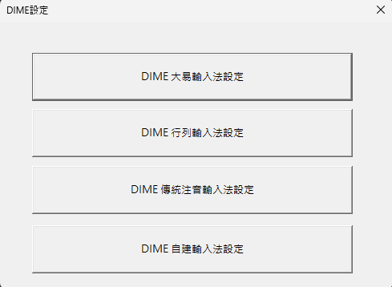
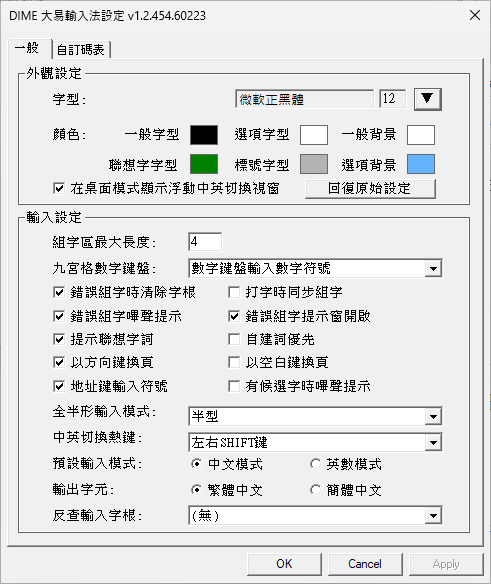
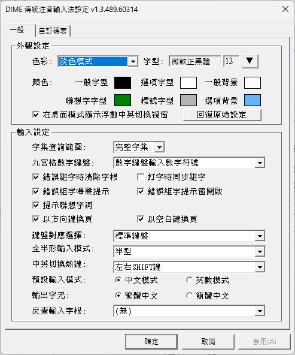
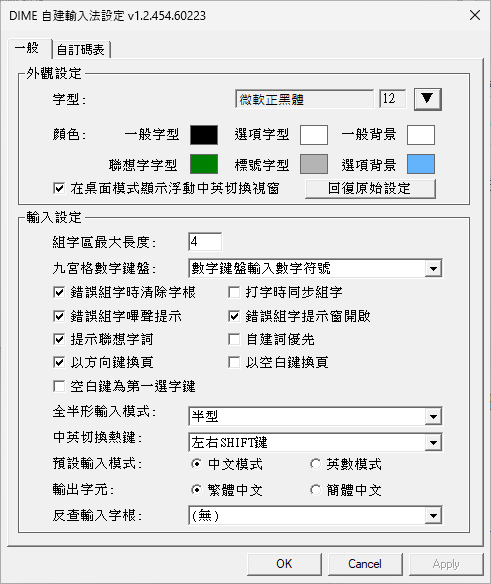
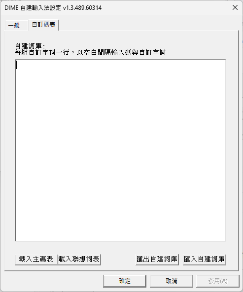

# DIME 輸入法

[](LICENSE)
[](https://github.com/jrywu/DIME)

DIME 是一套適用於 Windows 8/10/11 的輸入法框架，支援多種中文輸入法，包含大易、行列、注音、自建輸入法。

## 功能特色

- **大易輸入法**
  - 標準大易輸入法 (Windows 內建碼表或自行提供碼表)
- **行列輸入法 (行列30/行列40)**
  - 標準行列輸入法 (內建行列最新碼表)
  - 支援 Unicode CJK Ext-B、Ext-CD、Ext-EF (行列30)
- **傳統注音輸入法**
  - 支援標準/許氏 鍵盤排列
- **自訂字根檔**
  - 所有輸入法支援自行載入 .cin 碼表
- **自建詞庫輸入**
  - 所有輸入法支援自建詞庫
  - 支援自建詞庫匯入匯出
- **輕量化設計**
  - 100% 原生 C++ 開發，無第三方外部程式碼、函式庫或二進位檔案相依性
- **原生支援Windows各平台**
  - 同一套程式碼同時支援 Windows x86/x64/ARM64 架構
- **隱私保護**
  - 不學習使用者輸入內容，不連線網路，無任何隱私疑慮
- **開源專案**
  - 程式碼完全公開，歡迎檢視、使用與貢獻

## 安裝

### 下載與安裝步驟

1. 下載通用安裝檔 [DIME-x86armUniversal.zip](https://github.com/jrywu/DIME/raw/refs/heads/master/installer/DIME-x86armUniversal.zip)
   （單一安裝檔同時支援 x86/x64/ARM64 三種平台，安裝程式會自動偵測並安裝對應檔案）

2. 解壓縮至任意目錄

3. 執行 `DIME-x86armUniversal.exe` 進行安裝，安裝後會自動新增以下四種輸入法：
- **DIME自建** - 自訂 .cin 碼表輸入法
- **DIME傳統注音** - 傳統注音輸入法
- **DIME大易** - 大易輸入法
- **DIME行列** - 行列輸入法

> **注意：** 安裝程式未經數位簽章，執行時會出現末知發行商安全警告。這是因為程式碼簽章憑證費用高昂，而 DIME 是免費的開源軟體。DIME 為 100% 開源專案，不包含任何外部程式碼、函式庫或二進位檔案相依性，安全風險極低。如有疑慮，歡迎檢視[原始碼](https://github.com/jrywu/DIME)。

4. 如不需要全部輸入法，可在「設定」→「時間與語言」→「語言」→「中文(台灣)」→「選項」中，點選不需要的輸入法旁的「⋯」選單，選擇「移除」

### 移除

在「設定」→「應用程式」→「已安裝的應用程式」中，搜尋 DIME 並移除

## 設定

安裝後可透過開始選單中的「DIME設定」開啟設定程式，選擇要設定的輸入法：



- **DIME 大易輸入法設定**

  
- **DIME 行列輸入法設定**

  
- **DIME 傳統注音輸入法設定**

  
- **DIME 自建輸入法設定**

  

也可以在使用輸入法時，按下 `Ctrl + \` 直接開啟該輸入法的設定頁面。

## 快捷鍵

| 按鍵 | 功能 |
|------|------|
| Shift | 切換中英文模式 |
| Ctrl + Space | 切換中英文模式（永遠有效） |
| Shift + Space | 切換全形/半形 |
| Ctrl + \\ | 開啟輸入法設定頁面 |

### 快捷鍵設定選項

以下快捷鍵可在各輸入法設定頁面中調整：

**中英文切換方式：**
- 左右 Shift 鍵
- 右 Shift 鍵
- 左 Shift 鍵
- 無(僅 Ctrl + Space 鍵)

**全形/半形切換方式：**
- 以 Shift + Space 熱鍵切換
- 全形
- 半形

### 自建詞庫與自訂碼表

所有輸入法皆支援自建詞庫功能，可新增常用字詞、專有名詞或特殊符號。

 

**使用方式：**
- 每行輸入一組自訂字詞，格式為：`輸入碼[空白]自訂字詞`
- 例如：`abc 測試詞` 表示輸入 `abc` 即可出現「測試詞」

**功能按鈕：**

| 按鈕 | 說明 |
|------|------|
| 載入主碼表 | 載入自訂的 .cin 主碼表檔案 |
| 載入聯想詞表 | 載入額外的聯想詞庫 |
| 載入詞庫 | 載入行列詞庫（行列輸入法專用） |
| 匯出自訂詞庫 | 將目前自建詞庫匯出為檔案備份 |
| 匯入自訂詞庫 | 從檔案匯入自建詞庫（支援 UTF-8 及各種編碼） |

**相關設定：**
- **自訂詞優先**：勾選後，輸入時會優先顯示自建詞庫中的字詞
- **以 `'` 鍵查詢自建詞庫**（行列輸入法專用）：`'` 為行列詞彙輸入結束鍵，以 `'` 結束組字時，若勾選此選項會查詢自建詞庫，若不勾選則查詢內建行列詞庫（Array-Phrase.cin）

## 自訂碼表格式 (.cin)

DIME 支援標準 .cin 碼表格式，此格式源自 xcin 輸入法，廣泛應用於各種中文輸入法。檔案必須以 **UTF-8** 編碼儲存。

### 控制鍵

.cin 檔案使用 `%` 開頭的控制鍵定義碼表屬性，以 `#` 開頭的行為註解：

| 控制鍵 | 說明 | 範例 |
|--------|------|------|
| `#` | 註解（整行忽略） | `# 這是註解` |
| `%ename` | 英文名稱 | `%ename array30` |
| `%cname` | 中文名稱 | `%cname 行列30` |
| `%encoding` | 檔案編碼（建議 UTF-8） | `%encoding UTF-8` |
| `%selkey` | 選字鍵（最多10個） | `%selkey 1234567890` |
| `%endkey` | 組字結束鍵（注音聲調用） | `%endkey 3467` |
| `%keyname begin/end` | 字根對照表區段 | 見範例 |
| `%chardef begin/end` | 字碼對照表區段 | 見範例 |
| `%sorted` | **DIME 專屬**：索引加速（1=啟用） | `%sorted 1` |
| `%autoCompose` | 自動組字（1=啟用） | `%autoCompose 1` |

**`%sorted` 索引機制（DIME 專屬）：**

`%sorted` 是 DIME 專屬的控制鍵，用於大幅加速碼表查詢效能。當 `%sorted 1` 啟用時，DIME 會在載入碼表時建立**字首索引表（Radical Index Map）**：

1. **索引建立**：解析 `%chardef` 區段時，記錄每個輸入碼首字母第一次出現的檔案位置
2. **快速定位**：查詢時直接跳轉至該字母開頭的位置，無需從頭搜尋
3. **提前終止**：找到符合的字碼後，遇到不同首字母即停止搜尋

**使用條件：**
- `%chardef` 區段內的輸入碼**必須按字母順序排列**
- 排序以輸入碼首字元為主（不區分大小寫）

**效能比較：**

| 設定 | 搜尋方式 | 適用情境 |
|------|----------|----------|
| `%sorted 0` 或未設定 | 從頭到尾逐行搜尋 | 小型碼表、未排序碼表 |
| `%sorted 1` | 索引定位 + 提前終止 | 大型已排序碼表（建議） |

**範例：** 若碼表已排序，輸入 `ba` 查詢時：
1. 透過索引直接跳至 `b` 開頭的位置
2. 搜尋直到找到所有 `ba` 的對應字
3. 遇到 `bb` 或 `c` 開頭時立即停止

**建議：** 對於超過 10,000 筆資料的碼表，強烈建議碼表先行排序並啟用 `%sorted 1`。

### 檔案結構

```
# 註解
%ename    英文名稱
%cname    中文名稱
%selkey   選字鍵
%sorted   1

%keyname begin
按鍵	字根顯示
%keyname end

%chardef begin
輸入碼	輸出字詞
%chardef end
```

- **%keyname**：定義按鍵與字根符號對應，格式為 `按鍵<Tab>字根`
- **%chardef**：定義輸入碼與輸出字詞對應，格式為 `輸入碼<Tab>字詞`
- 同一輸入碼可對應多個字詞（多行）
- 若啟用 `%sorted 1`，chardef 必須按輸入碼排序
- **DIME 專屬**：引號 `"` 為選用，僅在內容包含空白時需要（原始 .cin 格式不支援空白）

### 範例

**基本範例：**
```
# 自訂輸入法
%ename	MyIME
%cname	我的輸入法
%encoding	UTF-8
%selkey	1234567890
%sorted	1

%keyname begin
a	Ａ
b	Ｂ
%keyname end

%chardef begin
a	啊
a	阿
ai	愛
b	不
ba	把
%chardef end
```

**行列輸入法 (Array.cin)：**
```
%ename	array30
%cname	行列30
%selkey	1234567890
%sorted	1

%keyname begin
a	1-
b	5v
c	3v
%keyname end

%chardef begin
,	，
,	火
,,	炎
%chardef end
```

**注音輸入法 (phone.cin)：** 使用 `%endkey` 定義聲調鍵
```
%ename	Phonetic
%cname	注音
%selkey	123456789
%endkey	3467

%keyname begin
3	ˇ
4	ˋ
1	ㄅ
%keyname end

%chardef begin
-	兒
-3	爾
-4	二
%chardef end
```

**聯想詞表/行列詞庫 (見Array-Phrase.cin)：** 可省略 `%keyname` 區段，直接使用 `%chardef` 定義輸入碼與字詞對應，並啟用 `%sorted 1` 加速查詢
```
%sorted	1
%chardef begin
,,,	米糕
,,,,	炎炎
,,r,	炎熱
%chardef end
```

## 檔案說明

### 安裝檔案

安裝程式會依據作業系統平台安裝對應的檔案：

**系統檔案：**

| 平台 | 檔案 | 安裝位置 | 說明 |
|------|------|----------|------|
| x64 | `DIME.dll` (x64) | System32 | 64 位元輸入法核心 |
| x64 | `DIME.dll` (x86) | SysWOW64 | 32 位元輸入法核心，供 x86 程式使用 |
| ARM64 | `DIME.dll` (ARM64EC) | System32 | ARM64EC 輸入法核心，支援 ARM64 原生程式與 x64 程式（透過 WOW 模擬執行） |
| ARM64 | `DIME.dll` (x86) | SysWOW64 | 32 位元輸入法核心，供 x86 程式使用（透過 WOW 模擬執行） |
| x86 | `DIME.dll` (x86) | System32 | 32 位元輸入法核心 |

**程式檔案（`%ProgramFiles%\DIME\`）：**

| 檔案 | 說明 |
|------|------|
| `DIMESettings.exe` | DIME 設定程式 |
| `Array.cin` | 行列30 主碼表 |
| `Array40.cin` | 行列40 主碼表 |
| `Array-Ext-B.cin` | 行列30 CJK Ext-B 擴充碼表 |
| `Array-Ext-CD.cin` | 行列30 CJK Ext-CD 擴充碼表 |
| `Array-Ext-EF.cin` | 行列30 CJK Ext-EF 擴充碼表 |
| `Array-Phrase.cin` | 行列詞庫 |
| `Array-shortcode.cin` | 行列簡碼表 |
| `Array-special.cin` | 行列特別碼表 |
| `phone.cin` | 注音碼表 |
| `TCFreq.cin` | 常用字頻率表（用於候選字排序） |
| `TCSC.cin` | 繁簡轉換對照表 |
| `uninst.exe` | 移除程式 |

### 使用者資料（`%APPDATA%\DIME\`）

DIME 會在使用者的漫遊設定檔資料夾建立 `DIME` 目錄，存放個人化設定與碼表：

**設定檔（.ini）：**

| 檔案 | 說明 |
|------|------|
| `DayiConfig.ini` | 大易輸入法設定 |
| `ArrayConfig.ini` | 行列輸入法設定 |
| `PhoneConfig.ini` | 注音輸入法設定 |
| `GenericConfig.ini` | 自建輸入法設定 |

**主碼表：**

DIME 執行時一律從此目錄讀取主碼表（.cin），碼表來源有兩種：
- **從 Program Files 複製**：行列（Array.cin）與注音（phone.cin）在首次使用時會自動從安裝目錄複製
- **從設定頁面載入**：使用者可透過各輸入法設定頁面的「載入主碼表」按鈕載入任意 .cin 檔案，載入時會自動轉換編碼（UTF-8 → UTF-16）並重新命名為該輸入法的固定檔名（見下表）

| 檔案 | 說明 |
|------|------|
| `Dayi.cin` | 大易主碼表 |
| `Array.cin` / `Array40.cin` | 行列主碼表 |
| `Phone.cin` | 注音碼表 |
| `Generic.cin` | 自建輸入法主碼表 |

**自建詞庫：**

使用者透過各輸入法設定頁面的「自建詞庫」功能新增自訂字詞時，會自動建立對應的詞庫檔案：

| 檔案 | 說明 |
|------|------|
| `DAYI-CUSTOM.cin` | 大易自建詞庫 |
| `ARRAY-CUSTOM.cin` | 行列自建詞庫 |
| `PHONETIC-CUSTOM.cin` | 注音自建詞庫 |
| `GENERIC-CUSTOM.cin` | 自建輸入法自建詞庫 |

**聯想詞庫：**

使用者透過各輸入法設定頁面的「載入聯想詞表」按鈕載入聯想詞庫時，會自動建立。此檔案為所有輸入法共用：

| 檔案 | 說明 |
|------|------|
| `Phrase.cin` | 通用聯想詞庫（所有輸入法共用） |

**行列專用碼表（行列30 模式）：**

首次使用行列30 模式時，會自動從安裝目錄複製：

| 檔案 | 說明 |
|------|------|
| `Array-Ext-B.cin` | CJK Ext-B 擴充字 |
| `Array-Ext-CD.cin` | CJK Ext-CD 擴充字 |
| `Array-Ext-EF.cin` | CJK Ext-EF 擴充字 |
| `Array-Phrase.cin` | 行列詞庫 |
| `Array-shortcode.cin` | 行列簡碼 |
| `Array-special.cin` | 行列特別碼 |

**其他：**

首次使用時，會自動從安裝目錄複製：

| 檔案 | 說明 |
|------|------|
| `TCFreq.cin` | 常用字頻率表 |
| `TCSC.cin` | 繁簡轉換表 |
| `TableTextServiceDaYi.txt` | Windows 內建大易碼表 |

## 問題回報

如遇到問題或有建議，歡迎透過以下方式回報：

### GitHub Issues

請至 [GitHub Issues](https://github.com/jrywu/DIME/issues) 提交問題回報，回報時請提供：

- **Windows 版本**：作業系統平台與版本（如 x64 Windows 11 23H2）
- **DIME 版本**：可在各輸入法設定頁面的視窗標題列中查看

### 行列輸入法功能建議

如有行列輸入法的新功能建議，請先至 [Facebook 行列輸入的家社團](https://www.facebook.com/groups/517104371955479/) 發文討論。

