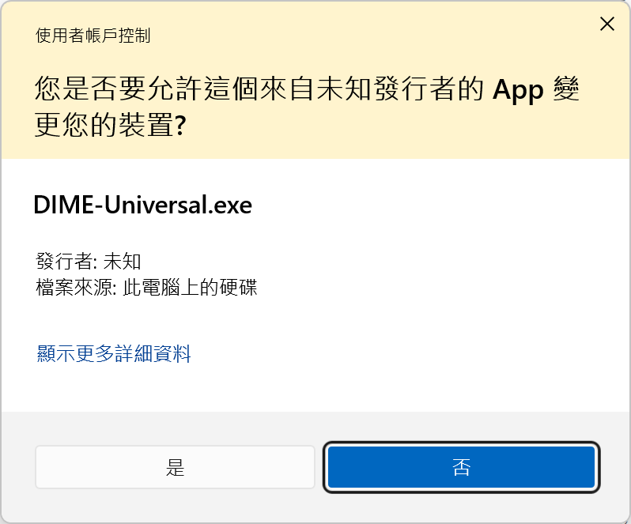
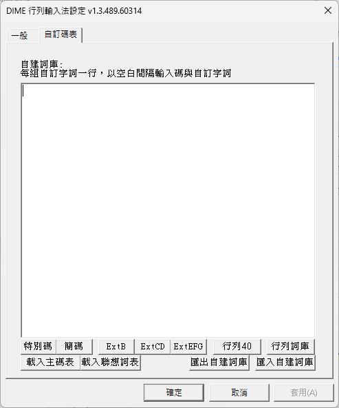

# DIME 輸入法

[](LICENSE.md)
[](https://github.com/jrywu/DIME)
[](https://github.com/jrywu/DIME/actions/workflows/DIME_tests.yml)
[](https://github.com/jrywu/DIME/actions/workflows/build_installer.yml)

DIME 是一套適用於 Windows 8/10/11 的輸入法框架，支援多種中文輸入法，包含大易、行列、注音、自建輸入法。

## 功能特色

- **原生支援Windows各平台**
  - 同一套程式碼同時支援 Windows x86/x64/ARM64 架構
  - 遵循 Windows TSF（Text Services Framework）標準，同時支援傳統桌面應用程式與 Microsoft Store 應用程式
- **大易輸入法**
  - 標準大易輸入法 (Windows 內建碼表或自行提供碼表)
- **行列輸入法 (行列30/行列40)**
  - 標準行列輸入法 (內建行列最新碼表)
  - 支援 Unicode CJK Ext-A~G (行列30)
- **傳統注音輸入法**
  - 支援標準/許氏 鍵盤排列
- **自訂字根檔**
  - 所有輸入法支援自行載入 .cin 碼表
- **自建詞庫輸入**
  - 所有輸入法支援自建詞庫
  - 支援自建詞庫匯入匯出
- **支持字根反查**
  - 支持Widnows TSF 標準反查界面，可以Windows 內建輸入法互相反查
- **輕量化設計**
  - 100% 原生 C++ 開發，無第三方外部程式碼、函式庫或二進位檔案相依性
- **隱私保護**
  - 不學習使用者輸入內容，不連線網路，無任何隱私疑慮
- **開源專案**
  - 程式碼完全公開，歡迎檢視、使用與貢獻

## 安裝

### 下載與安裝步驟

1. 下載通用安裝檔

   **最新穩定發行版本 DIME v.1.2.381（更新日期: 2026-02-17）**

   [DIME-Universal.zip](https://github.com/jrywu/DIME/raw/1.2.381/installer/DIME-Universal.zip)

   <!-- DOWNLOAD_START -->
   **最新開發版本 DIME v1.2.440 (更新日期: 2026-02-21)**
   <!-- DOWNLOAD_END --> 

   [DIME-Universal.zip](https://github.com/jrywu/DIME/raw/refs/heads/master/installer/DIME-Universal.zip)
 
   （單一安裝檔同時支援 x86/x64/ARM64 三種平台，安裝程式會自動偵測並安裝對應檔案）

2. 解壓縮 `DIME-Universal.zip` 取得 `DIME-Universal.exe` 安裝檔至任意目錄

3. **（建議）驗證檔案完整性：**

   **最新穩定發行版本 DIME v.1.2.381 SHA-256 CHECKSUM (更新日期: 2026-02-17):**
   
   | 檔案 | SHA-256 CHECKSUM |
   |------|----------------|
   | DIME-Universal.exe | `F0825ACCEF2E089AE80410DF0325BADE917D38354A8FC69A4493493DF1ADEDB9` |
   | DIME-Universal.zip | `1F7A105F70305FE99DFCD49C6DA67F16B5C54FFDFA48665EE3969C24D18DFEDA` |
   
   <!-- CHECKSUM_START -->
   **最新開發版本 DIME v1.2.440 SHA-256 CHECKSUM (更新日期: 2026-02-21):**
   
   | 檔案 | SHA-256 CHECKSUM |
   |------|----------------|
   | DIME-Universal.exe | `1DAC99F3AA52D30AE84F1BEB176039D2EFD3AE2E6C4500130909200EA4C60641` |
   | DIME-Universal.zip | `89CC7A843446FB801AE486FA0A179B15E1D5C871C95181DDBE6435D9FFCDB16E` |
   <!-- CHECKSUM_END -->
   
   建議用如下Powershell指令，取得 SHA-256 CHECKSUM，將顯示的CHECKSUM 與上方表格中公布的值比對。
   ```powershell
   # 驗證 .exe 檔案
   Get-FileHash DIME-Universal.exe -Algorithm SHA256

   # 或驗證 .zip 檔案
   Get-FileHash DIME-Universal.zip -Algorithm SHA256
   ```
   
   
   > **為什麼需要驗證？** 安裝程式未經數位簽章，因此無法透過 Windows 驗證發行商身分。透過比對 SHA-256 CHECKSUM 可確保下載的檔案與DIME正式發布版本完全一致，未經竄改。

4. 執行 `DIME-Universal.exe` 進行安裝，安裝後會自動新增以下四種輸入法：
    - **DIME自建** - 自建 .cin 碼表輸入法
    - **DIME傳統注音** - 傳統注音輸入法
    - **DIME大易** - 大易輸入法
    - **DIME行列** - 行列輸入法

    > **安裝時的安全警告**
    > 
    > 執行 DIME 安裝程式時，Windows 會顯示使用者帳戶控制 (UAC) 提示，如下所示：
    > 
    > 
    > 
    > **為什麼需要系統管理員權限？**
    >
    > DIME 安裝程式需要系統管理員權限 (elevation rights) 才能完成以下操作：
    >
    > - **註冊輸入法服務**：將 DIME 註冊為 Windows Text Services Framework (TSF) 輸入法，需要寫入系統登錄檔
    > - **複製系統檔案**：將輸入法 DLL 檔案安裝到系統目錄（詳見[檔案說明](#檔案說明)）
    > - **設定系統組態**：配置輸入法在所有使用者帳戶中可用的相關設定
    >
    > 這些操作都需要系統管理員權限才能執行，這是所有輸入法安裝程式的標準要求。
    >
    > **為什麼顯示「未知的發行者」？**
    >
    > UAC 對話框中顯示「**未知的發行者**」(Unknown Publisher)，並且檔案資訊顯示「無法驗證發行者」，這是因為：
    >
    > - **未經數位簽章**：DIME 安裝程式未使用程式碼簽章憑證 (Code Signing Certificate) 進行數位簽章
    > - **簽章成本考量**：程式碼簽章憑證每年需要數百至數千美元的費用，對於免費開源專案來說成本過高
    > - **Windows 安全機制**：Windows 無法驗證安裝程式的發行者身分，因此會顯示此警告
    >
    > **這樣安全嗎？**
    >
    > 儘管顯示未知發行者警告，DIME 仍然是安全的，原因如下：
    >
    > ✅ **100% 開源**：所有原始碼公開於 [GitHub](https://github.com/jrywu/DIME)，任何人都可以檢視和審查
    >
    > ✅ **無外部依賴**：使用純 C++ 開發，不包含任何第三方程式庫、外部程式碼或可疑的二進位檔案
    >
    > ✅ **可驗證完整性**：請務必從[DIME GitHub 頁面下載安裝包](https://github.com/jrywu/DIME) 並比對 SHA-256 CHECKSUM，以確認下載的檔案未經竄改（見步驟 3）
    >
    > ✅ **無網路連線**：不會連接網路，不會收集或傳送任何使用者資料
    >
    > ✅ **社群驗證**：開源社群可以驗證程式碼的安全性

5. 如不需要全部輸入法，可在「設定」→「時間與語言」→「語言」→「中文(台灣)」→「選項」中，點選不需要的輸入法旁的「⋯」選單，選擇「移除」


### 移除

在「設定」→「應用程式」→「已安裝的應用程式」中，搜尋 DIME 並移除

## 使用說明

DIME 安裝完成後會自動新增以下四種輸入法：DIME大易、DIME行列、DIME傳統注音、DIME自建。前三者安裝後即可使用，DIME自建則需先透過設定頁面載入自訂 .cin 碼表才能使用，碼表格式請參考[自訂碼表格式](#自訂碼表格式-cin)說明。

使用時，點選 Windows 工作列上的語言圖示，或按 `Windows + Space` 在已安裝的輸入法之間循環切換，選擇所需的 DIME 輸入法。

### 快捷鍵

選擇 DIME 輸入法後，可使用以下快捷鍵切換中文/英數模式及其他功能：

| 按鍵 | 功能 |
|------|------|
| Shift | 切換中英模式 |
| Shift（按住） | Shift 英數輸入模式（見[Shift 英數輸入模式](#shift-英數輸入模式)說明） |
| Ctrl + Space | 切換中英模式（永遠有效） |
| Shift + Space | 切換全形/半形 |
| Ctrl + \\ | 開啟輸入法設定頁面 |

**快捷鍵設定選項：**

以下快捷鍵可在各輸入法設定頁面中調整：

**中文/英數切換方式：**
- 左右 Shift 鍵
- 右 Shift 鍵
- 左 Shift 鍵
- 無(僅 Ctrl + Space 鍵)

**全形/半形切換方式：**
- 以 Shift + Space 熱鍵切換
- 全形
- 半形

### Shift 英數輸入模式

在中文輸入模式下，按住 Shift 鍵可直接輸入英數字元，無需切回中文模式。所有可列印 ASCII 字元（字母、數字、符號、空格）在按住 Shift 時會完全繞過輸入法引擎，直接輸出對應字元。

**CapsLock 控制輸出字元：**

| CapsLock 狀態 | Shift + 按鍵 | 範例 |
|--------------|-------------|------|
| OFF | 輸出基礎字元（小寫字母、數字、基本符號） | Shift+A → `a`、Shift+1 → `1`、Shift+- → `-` |
| ON | 輸出 Shift 字元（大寫字母、特殊符號） | Shift+A → `A`、Shift+1 → `!`、Shift+2 → `@` |

**使用範例：**

- **中英混合輸入**：輸入「請使用」→ 按住 Shift 輸入 ` git commit ` → 輸入「命令」，即可得到「請使用 git commit 命令」。按住 Shift 期間可連續輸入英數字元及空格（Shift+Space 直接產生空格）。
- **電子郵件地址**：CapsLock OFF 按住 Shift 輸入 `user`，切換 CapsLock ON 按住 Shift 輸入 `2` 產生 `@`，切換 CapsLock OFF 按住 Shift 輸入 `example.com`。
- **程式碼片段**：CapsLock OFF 按住 Shift 輸入 `int`，切換 CapsLock ON 按住 Shift 輸入 `8` 產生 `*`，切換 CapsLock OFF 按住 Shift 輸入 ` ptr = nullptr;`。

> **注意**：當「全形/半形切換」設定為「以 Shift-Space 熱鍵切換」時，Shift+Space 保留給全形/半形切換使用，不會輸入空格；此時需放開 Shift 後按 Space 來輸入空格。

### 聯想詞

所有輸入法皆支援聯想詞功能，DIME 內建聯想詞表，安裝後即可使用。在各輸入法設定頁面勾選「提示聯想字詞」即可啟用，選字後會自動顯示相關聯想詞，以 `Shift + 1~0` 選字，方便快速輸入常用詞組。查詢順序可切換為`先查詢自建詞庫再查詢主碼表`或`先查詢主碼表再查詢自建詞庫`。使用者也可透過設定頁面的「載入聯想詞表」按鈕載入自訂聯想詞庫，聯想詞表格式請參考[聯想詞表格式](#聯想詞表格式)說明。

### DIME 輸入法設定

可透過開始選單中的「DIME設定」開啟設定程式，選擇要設定的輸入法：


也可以在使用輸入法時，按下 `Ctrl + \` 直接開啟該輸入法的設定頁面。

### 通用設定

以下設定在所有輸入法設定頁面中皆可使用：

| 設定 | 說明 |
|------|------|
| 九宮格數字鍵盤 | 設定右方九官格數字鍵盤的功能（數字輸入或選字） |
| 錯誤組字時清除字根 | 輸入錯誤時自動清除已輸入的字根 |
| 錯誤組字嗶聲提示 | 輸入錯誤時發出嗶聲 |
| 錯誤組字提示窗開啟 | 輸入錯誤時顯示提示視窗 |
| 提示聯想字詞 | 選字後顯示相關聯想詞 (切換`先查詢自建詞庫再查詢主碼表`/`先查詢主碼表再查詢自建詞庫`) |
| 以方向鍵換頁 | 使用左右方向鍵切換候選字頁面 |
| 以空白鍵換頁 | 使用空白鍵切換至下一頁候選字 |
| 全半形輸入模式 | 設定`全形`/`半形`輸入模式（以 Shift+Space 切換、全形、半形） |
| 中英切換熱鍵 | 設定切換`中文`/`英數`輸入的熱鍵（左右 Shift、右 Shift、左 Shift、僅 Ctrl+Space） |
| 預設輸入模式 | 啟動時預設為`中文`或`英數`模式 |
| 輸出字元 | 輸出繁體中文或簡體中文 (簡繁轉換) |
| 反查輸入字根 | 選擇用於反查字根的輸入法（可與 Windows 內建輸入法互查） |

### 外觀設定

| 設定 | 說明 |
|------|------|
| 字型 | 候選字視窗的字型與大小 |
| 顏色 | 候選字視窗各元素的顏色設定（一般字型、選項字型、背景、聯想字、標號等） |
| 在桌面模式顯示浮動中英切換視窗 | 跟隨系統游標顯示浮動`中文`/`英數`切換提示視窗 |
| 回復原始設定 | 將外觀設定還原為預設值 |

### DIME 大易

標準大易輸入法，支援 Windows 內建碼表或自行提供 .cin 碼表。


**大易專屬設定：**

| 設定 | 說明 |
|------|------|
| 地址鍵輸入符號 | 啟用後可用地址鍵輸入全形符號（見下表） |
| 有候選字時嗶聲提示 | 出現候選字時發出提示音 |

**地址鍵符號對照表：**

| 按鍵 | 地址模式 | 符號模式 |
|------|----------|----------|
| ` | 巷 | ： |
| ' | 號 | ， |
| [ | 路 | 。 |
| ] | 街 | ？ |
| - | 鄉 | 、 |
| \ | 鎮 | ； |

### DIME 行列

標準行列輸入法（行列30/行列40），內建行列最新碼表，支援 Unicode CJK Ext-A~G（行列30）。


**行列專屬設定：**

| 設定 | 說明 |
|------|------|
| 行列查詢碼表 | 選擇行列30或行列40模式（見下表） |
| 僅接受輸入特別碼 | 啟用後僅能輸入特別碼，不接受一般字碼 |
| 特別碼提示 | 輸入一般字碼時提示對應的特別碼 |
| 以 `'` 鍵查詢自建詞庫 | `'` 為詞彙結束鍵，勾選時查詢自建詞庫，否則查詢內建行列詞庫 |

**行列查詢碼表選項：**

| 選項 | 說明 |
|------|------|
| 行列30 Unicode Ext-A | 行列30，支援 CJK 基本區與擴充 A 區 |
| 行列30 Unicode Ext-AB | 行列30，支援 CJK 基本區與擴充 A、B 區 |
| 行列30 Unicode Ext-A~D | 行列30，支援 CJK 基本區與擴充 A~D 區 |
| 行列30 Unicode Ext-A~G | 行列30，支援 CJK 基本區與擴充 A~G 區 |
| 行列40 Big5 | 行列40，僅支援 Big5 字集 |

**行列額外碼表：**

行列輸入法頁面`載入主碼表`按鍵可載入客製行列30主碼表，並支援載入額外碼表，透過此頁面的按鈕進行載入：



| 按鈕 | 碼表檔案 | 說明 |
|------|---------|------|
| `特別碼` | Array-special.cin | 載入行列特別碼碼表 |
| `簡碼` | Array-shortcode.cin | 載入行列簡碼碼表 |
| `ExtB` | Array-Ext-B.cin | 載入行列CJK 擴充 B 區罕用字碼表 |
| `ExtCD` | Array-Ext-CD.cin | 載入行列CJK 擴充 C、D 區罕用字碼表 |
| `ExtEFG` | Array-Ext-EF.cin | 載入行列CJK 擴充 E、F、G 區罕用字碼表 |
| `行列詞庫` | Array-Phrase.cin | 載入行列詞彙輸入碼表|
| `行列40` | Array40.cin | 載入行列40 碼表|

> **自訂碼表提示：** 若要客製化這些碼表內容，可直接編輯內建的 .cin 檔案（位於 `%ProgramFiles%\DIME\` 目錄），編輯存檔後點選對應按鈕重新載入即可生效。碼表格式請參考[自訂碼表格式](#自訂碼表格式-cin)說明。

### DIME 傳統注音

傳統注音輸入法，支援標準/許氏鍵盤排列。


**注音專屬設定：**

| 設定 | 說明 |
|------|------|
| 鍵盤對應選擇 | 選擇標準注音鍵盤或許氏鍵盤排列 |

### DIME 自建

自建 .cin 碼表輸入法，可載入任意 .cin 碼表作為輸入法使用。


**自建專屬設定：**

| 設定 | 說明 |
|------|------|
| 組字區最大長度 | 設定輸入碼的最大字元數 |
| 打字時同步組字 | 輸入時即時查詢並顯示候選字 |
| 空白鍵為第一選字鍵 | 以空白鍵選擇第一個候選字 |

### 自建詞庫與自訂碼表

所有輸入法皆支援自建詞庫功能，可新增常用字詞、專有名詞或特殊符號。


**使用方式：**
- 每行輸入一組自訂字詞，格式為：`輸入碼[空白]自訂字詞`
- 例如：`abc 測試詞` 表示輸入 `abc` 即可出現「測試詞」

**功能按鈕：**

| 按鈕 | 說明 |
|------|------|
| 載入主碼表 | 載入自訂的 .cin 主碼表檔案 |
| 載入聯想詞表 | 載入額外的聯想詞庫 |
| 載入詞庫 | 載入行列詞庫（行列輸入法專用） |
| 匯出自建詞庫 | 將目前自建詞庫匯出為檔案備份 |
| 匯入自建詞庫 | 從檔案匯入自建詞庫（支援 UTF-8 及各種編碼） |

**相關設定：**
- **自建詞優先**：勾選後，輸入時會優先顯示自建詞庫中的字詞
- **以 `'` 鍵查詢自建詞庫**（行列輸入法專用）：`'` 為行列詞彙輸入結束鍵，以 `'` 結束組字時，若勾選此選項會查詢自建詞庫，若不勾選則查詢內建行列詞庫（Array-Phrase.cin）

## 自訂碼表格式 (.cin)

DIME 支援標準 .cin 碼表格式，此格式源自 xcin 輸入法，廣泛應用於各種中文輸入法。檔案必須以 **UTF-8** 編碼儲存。

### 控制鍵與註解

.cin 檔案使用 `%` 開頭的控制鍵定義碼表屬性，以 `#` 開頭的行為註解：

| 控制鍵 | 說明 | 範例 |
|--------|------|------|
| `#` | 註解（整行忽略） | `# 這是註解` |
| `%ename` | 英文名稱 | `%ename array30` |
| `%cname` | 中文名稱 | `%cname 行列30` |
| `%encoding` | 檔案編碼（建議 UTF-8） | `%encoding UTF-8` |
| `%selkey` | 選字鍵（最多10個） | `%selkey 1234567890` |
| `%endkey` | 組字結束鍵（注音聲調用） | `%endkey 3467` |
| `%keyname begin/end` | 字根對照表區段 | 見範例 |
| `%chardef begin/end` | 字碼對照表區段 | 見範例 |
| `%sorted` | **DIME 專屬**：索引加速（1=啟用） | `%sorted 1` |
| `%autoCompose` | 自動組字（1=啟用） | `%autoCompose 1` |

**`%sorted` 索引機制（DIME 專屬）：**

`%sorted` 是 DIME 專屬的控制鍵，用於大幅加速碼表查詢效能。當 `%sorted 1` 啟用時，DIME 會在載入碼表時建立**字首索引表（Radical Index Map）**：

1. **索引建立**：解析 `%chardef` 區段時，記錄每個輸入碼首碼第一次出現的檔案位置
2. **快速定位**：查詢時直接跳轉至輸入首碼開頭的位置，無需從頭搜尋
3. **提前終止**：找到符合的字碼後，遇到不同首字母即停止搜尋

**使用條件：**
 `%chardef` 區段內的輸入碼**必須先行排序** (不區分大小寫)

**效能比較：**

| 設定 | 搜尋方式 | 適用情境 |
|------|----------|----------|
| `%sorted 0` 或未設定 | 從頭到尾逐行搜尋 | 小型碼表、未排序碼表 |
| `%sorted 1` | 索引定位 + 提前終止 | 大型已排序碼表（建議） |

**範例：** 若碼表已排序，輸入 `ba` 查詢時：
1. 透過索引直接跳至 `b` 開頭的位置
2. 搜尋直到找到所有 `ba` 的對應字
3. 遇到 `bb` 或 `c` 開頭時立即停止

**建議：** 對於超過 10,000 筆資料的碼表，強烈建議碼表先行排序並啟用 `%sorted 1`。

### 檔案結構

```
# 註解
%ename    英文名稱
%cname    中文名稱
%selkey   選字鍵
%sorted   1

%keyname begin
按鍵	字根顯示
%keyname end

%chardef begin
輸入碼	輸出字詞
%chardef end
```

- **%keyname**：定義按鍵與字根符號對應，格式為 `按鍵<Tab>字根` 或 `按鍵<空格>字根`
- **%chardef**：定義輸入碼與輸出字詞對應，格式為 `輸入碼<Tab>字詞` `輸入碼<空格>字詞`
- 同一輸入碼可對應多個字詞（多行）
- 若啟用 `%sorted 1`，`%chardef` 段落必須按輸入碼排序
- **DIME 專屬**：雙引號 `"` 為選用，僅在內容包含空白時需要（原始 .cin 格式不支援空白）

### 範例

**基本範例：**
```
# 自訂輸入法
%ename	MyIME
%cname	我的輸入法
%encoding	UTF-8
%selkey	1234567890
%sorted	1

%keyname begin
a	Ａ
b	Ｂ
%keyname end

%chardef begin
a	啊
a	阿
ai	愛
b	不
ba	把
%chardef end
```

**行列輸入法 (Array.cin)：**
```
%ename	array30
%cname	行列30
%selkey	1234567890
%sorted	1

%keyname begin
a	1-
b	5v
c	3v
%keyname end

%chardef begin
,	，
,	火
,,	炎
%chardef end
```

**注音輸入法 (phone.cin)：** 使用 `%endkey` 定義聲調鍵
```
%ename	Phonetic
%cname	注音
%selkey	123456789
%endkey	3467

%keyname begin
3	ˇ
4	ˋ
1	ㄅ
%keyname end

%chardef begin
-	兒
-3	爾
-4	二
%chardef end
```

**聯想詞表/行列詞庫 (見Array-Phrase.cin)：** 可省略 `%keyname` 區段，直接使用 `%chardef` 定義輸入碼與字詞對應，並啟用 `%sorted 1` 加速查詢
```
%sorted	1
%chardef begin
,,,	米糕
,,,,	炎炎
,,r,	炎熱
%chardef end
```

### 聯想詞表格式

聯想詞表使用 .cin 碼表格式，可省略 `%keyname` 區段，直接使用 `%chardef` 定義輸入碼與字詞對應，並建議啟用 `%sorted 1` 加速查詢。詳細格式請參考[自訂碼表格式](#自訂碼表格式-cin)說明。

## 檔案說明

### 安裝檔案

安裝程式會依據作業系統平台安裝對應的檔案：

**系統檔案：**

| 平台 | 檔案 | 安裝位置 | 說明 |
|------|------|----------|------|
| x64 | `DIME.dll` (x64) | System32 | 64 位元輸入法核心 |
| x64 | `DIME.dll` (x86) | SysWOW64 | 32 位元輸入法核心，供 x86 程式使用 |
| ARM64 | `DIME.dll` (ARM64EC) | System32 | ARM64EC 輸入法核心，支援 ARM64 原生程式與 x64 程式（模擬環境） |
| ARM64 | `DIME.dll` (x86) | SysWOW64 | 32 位元輸入法核心，供 x86 程式使用（模擬環境） |
| x86 | `DIME.dll` (x86) | System32 | 32 位元輸入法核心 |

**程式檔案（`%ProgramFiles%\DIME\`）：**

| 檔案 | 說明 |
|------|------|
| `DIMESettings.exe` | DIME 設定程式 |
| `Array.cin` | 行列30 主碼表 |
| `Array40.cin` | 行列40 主碼表 |
| `Array-Ext-B.cin` | 行列30 CJK Ext-B 擴充碼表 |
| `Array-Ext-CD.cin` | 行列30 CJK Ext-CD 擴充碼表 |
| `Array-Ext-EF.cin` | 行列30 CJK Ext-EF 擴充碼表 |
| `Array-Phrase.cin` | 行列詞庫 |
| `Array-shortcode.cin` | 行列簡碼表 |
| `Array-special.cin` | 行列特別碼表 |
| `phone.cin` | 注音碼表 |
| `TCFreq.cin` | 常用字頻率表（用於候選字排序） |
| `TCSC.cin` | 繁簡轉換對照表 |
| `uninst.exe` | 移除程式 |

### 使用者資料（`%APPDATA%\DIME\`）

DIME 會在使用者的漫遊設定檔資料夾建立 `DIME` 目錄，存放個人化設定與碼表：

**設定檔（.ini）：**

| 檔案 | 說明 |
|------|------|
| `DayiConfig.ini` | 大易輸入法設定 |
| `ArrayConfig.ini` | 行列輸入法設定 |
| `PhoneConfig.ini` | 注音輸入法設定 |
| `GenericConfig.ini` | 自建輸入法設定 |

**主碼表：**

DIME 執行時一律從此目錄讀取碼表（.cin），碼表來源有兩種：
- **從 Program Files 複製**：行列（Array.cin）與注音（phone.cin）在首次使用時會自動從安裝目錄複製
- **從設定頁面載入**：使用者可透過各輸入法設定頁面的「載入主碼表」按鈕載入任意 .cin 檔案，載入時會自動轉換編碼（UTF-8 → UTF-16）並重新命名為該輸入法的固定檔名（見下表）

| 檔案 | 說明 |
|------|------|
| `Dayi.cin` | 大易主碼表 |
| `Array.cin` / `Array40.cin` | 行列30/40主碼表 |
| `Phone.cin` | 注音碼表 |
| `Generic.cin` | 自建輸入法主碼表 |

**自建詞庫：**

使用者透過各輸入法設定頁面的「自建詞庫」功能新增自建字詞時，會自動建立對應的詞庫檔案：


| 檔案類型 | 檔案名稱 | 說明 |
|---------|---------|------|
| 使用者編輯格式 (.txt) | `DAYI-CUSTOM.txt` | 大易自建詞庫（可直接編輯的文字檔） |
| 輸入法引擎格式 (.cin) | `DAYI-CUSTOM.cin` | 大易自建詞庫（輸入法實際使用） |
| 使用者編輯格式 (.txt) | `ARRAY-CUSTOM.txt` | 行列自建詞庫（可直接編輯的文字檔） |
| 輸入法引擎格式 (.cin) | `ARRAY-CUSTOM.cin` | 行列自建詞庫（輸入法實際使用） |
| 使用者編輯格式 (.txt) | `PHONETIC-CUSTOM.txt` | 注音自建詞庫（可直接編輯的文字檔） |
| 輸入法引擎格式 (.cin) | `PHONETIC-CUSTOM.cin` | 注音自建詞庫（輸入法實際使用） |
| 使用者編輯格式 (.txt) | `GENERIC-CUSTOM.txt` | 自建輸入法自建詞庫（可直接編輯的文字檔） |
| 輸入法引擎格式 (.cin) | `GENERIC-CUSTOM.cin` | 自建輸入法自建詞庫（輸入法實際使用） |
```
.txt 檔案（使用者編輯格式）
  📝 使用者可直接用文字編輯器開啟修改
  💾 UTF-16LE 編碼（含 BOM）
  📋 簡化格式：僅包含 `輸入碼 字詞` 的內容
  🖊️ 設定頁面編輯框顯示和編輯的就是此檔案內容
  💡 可手動編輯後，下次開啟設定頁面會自動載入

.cin 檔案（輸入法引擎格式）
  ⚙️ 輸入法引擎實際載入使用的碼表
  💾 UTF-16LE 編碼
  📋 標準 .cin 格式：包含 `%chardef begin/end` 控制區段
  🔤 特殊字元自動跳脫處理（`\` → `\\`、`"` → `\"`，並視需要加上雙引號）
  🔄 每次點選「套用」時，會自動從 `.txt` 轉換生成
```

**聯想詞庫：**

使用者透過各輸入法設定頁面的「載入聯想詞表」按鈕載入聯想詞庫時，會自動建立。此檔案為所有輸入法共用：

| 檔案 | 說明 |
|------|------|
| `Phrase.cin` | 通用聯想詞庫（所有輸入法共用） |

**行列專用碼表：**

首次使用行列輸入法時，會自動從安裝目錄複製：

| 檔案 | 說明 |
|------|------|
| `Array.cin` | 行列30 主碼表 |
| `Array-Ext-B.cin` | CJK Ext-B 擴充字 |
| `Array-Ext-CD.cin` | CJK Ext-CD 擴充字 |
| `Array-Ext-EF.cin` | CJK Ext-EFG 擴充字 |
| `Array-Phrase.cin` | 行列詞庫 |
| `Array-shortcode.cin` | 行列簡碼 |
| `Array-special.cin` | 行列特別碼 |
| `Array40.cin` | 行列40 碼表(當選用行列40) |


**其他：**

首次使用時，會自動從安裝目錄複製：

| 檔案 | 說明 |
|------|------|
| `TCFreq.cin` | 常用字頻率表 |
| `TCSC.cin` | 繁簡轉換表 |
| `TableTextServiceDaYi.txt` | Windows 內建大易碼表 (首次使用從 `%PROGRAMFILES%\Windows NT\TableTextService` 目錄複製) |

## 開發者 / For Developers

DIME 是開源專案，歡迎開發者 fork 並基於 DIME 建立衍生專案或軟體。

DIME is an open-source project. Developers are welcome to fork and build derivative projects or software based on DIME.

**專案特色 / Project Highlights:**
- ✅ **100% 原生 C++** / 100% Native C++ - 無外部依賴 / No external dependencies
- ✅ **BSD 3-Clause 授權** / BSD 3-Clause License - 商業與非商業皆可使用 / Free for commercial and non-commercial use
- ✅ **多平台支援** / Multi-platform Support - x86/x64/ARM64EC 單一程式碼基底 / Single codebase for all platforms
- ✅ **完整的 TSF 實作** / Complete TSF Implementation - Windows Text Services Framework 標準實作 / Standard Windows TSF implementation

**從原始碼建置 DIME / Building DIME from Source:**

如果您想要自行編譯 DIME 或修改原始碼，請參閱完整的編譯指南：

If you want to build DIME yourself or modify the source code, please refer to the complete build guide:

📖 **[HOW_TO_BUILD](docs/HOW_TO_BUILD.md)**

此文件包含詳細的編譯步驟、開發環境設定、多平台建置說明。

This document contains detailed build instructions, development environment setup, multi-platform build guidance.

## 問題回報

如遇到問題或有建議，歡迎透過以下方式回報：

### GitHub Issues

請至 [GitHub Issues](https://github.com/jrywu/DIME/issues) 提交問題回報，回報時請提供：

- **Windows 版本**：作業系統平台與版本（如 x64 Windows 11 23H2）
- **DIME 版本**：可在各輸入法設定頁面的視窗標題列中查看

### 行列輸入法功能建議

如有行列輸入法的新功能建議，請先至 [Facebook 行列輸入的家社團](https://www.facebook.com/groups/517104371955479/) 發文討論。

