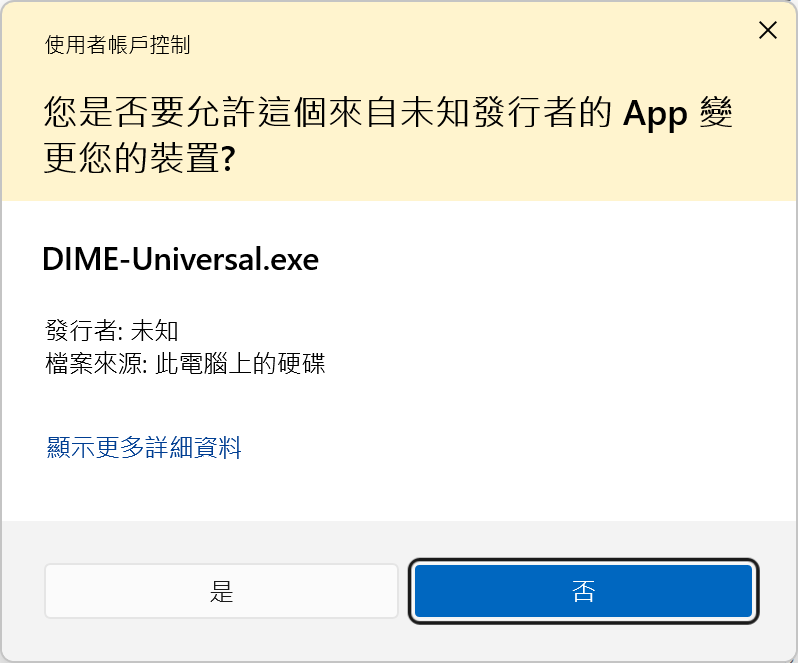
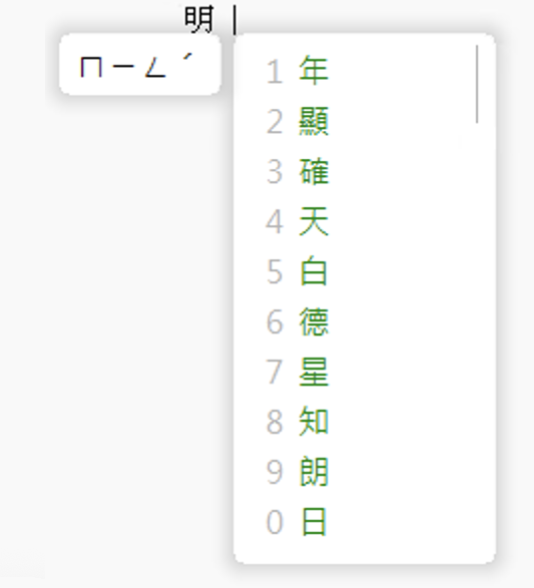
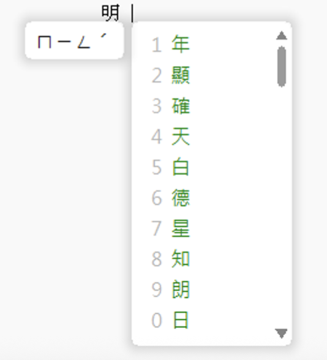
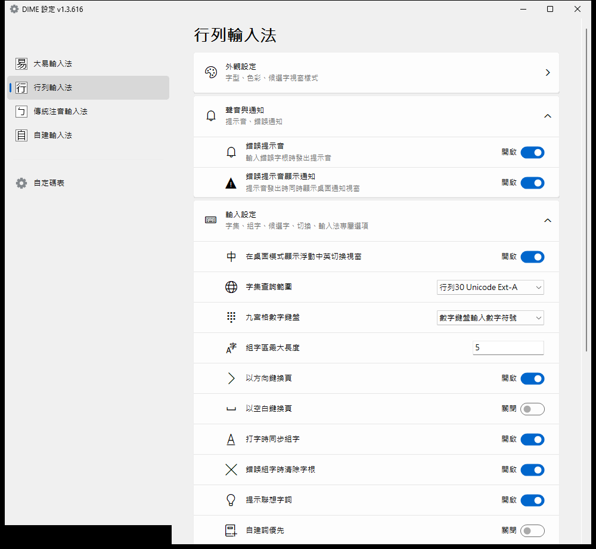
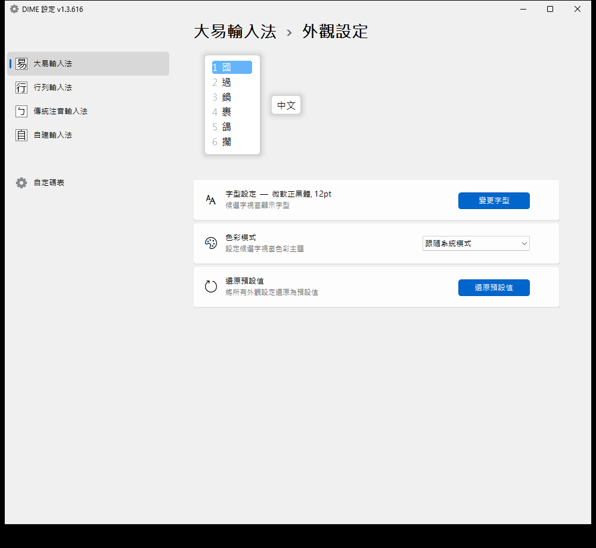
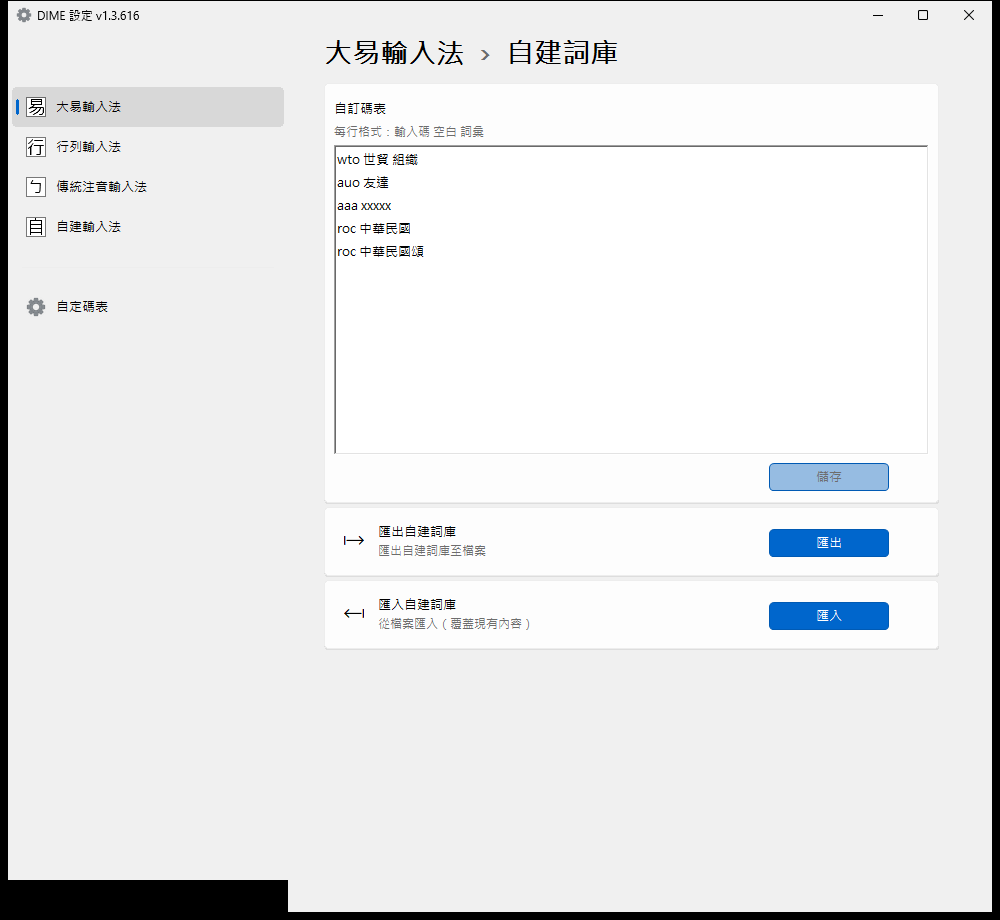
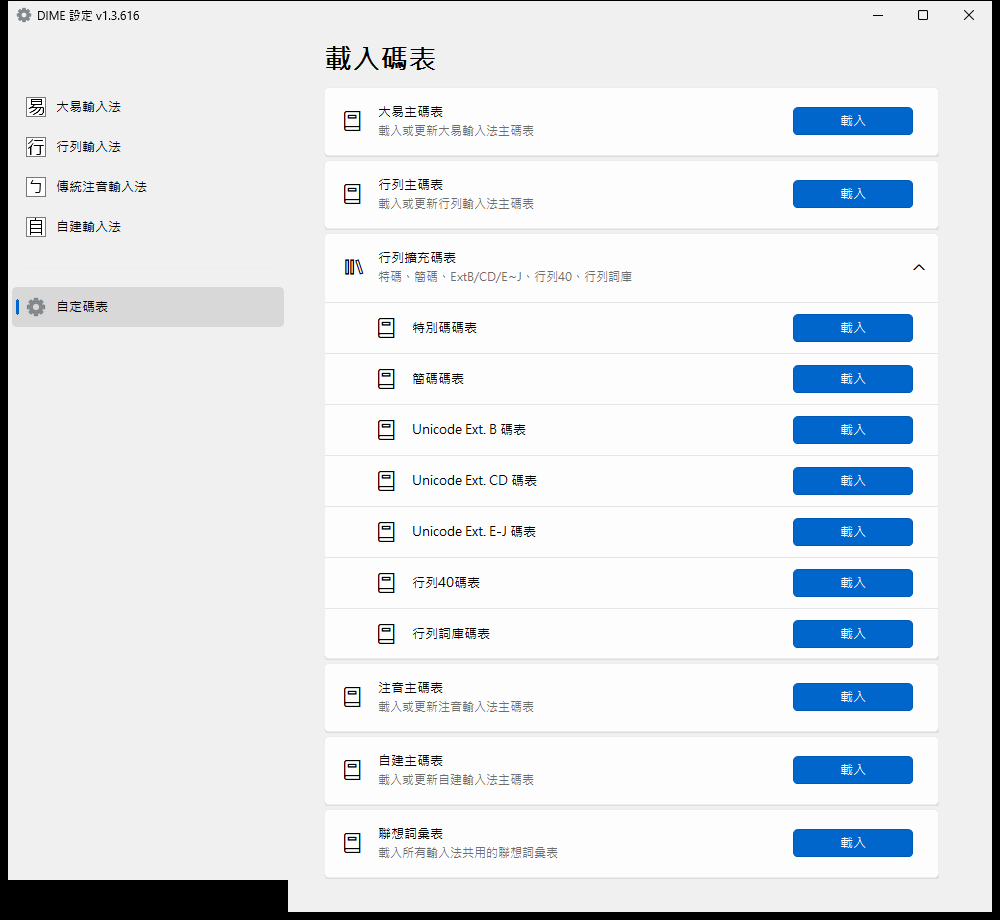

# DIME 輸入法

[](LICENSE.md)
[](https://github.com/jrywu/DIME)
[](https://github.com/jrywu/DIME/actions/workflows/DIME_tests.yml)
[](https://github.com/jrywu/DIME/actions/workflows/build_installer.yml)

DIME 是一套適用於 Windows 8/10/11 的輸入法框架，支援多種中文輸入法，包含大易、行列、注音、自建輸入法。

## 功能特色

- **原生支援Windows各平台**
  - 同一套程式碼同時支援 Windows x86/x64/ARM64 架構
  - 遵循 Windows TSF（Text Services Framework）標準，同時支援傳統桌面應用程式與 Microsoft Store 應用程式
- **大易輸入法**
  - 標準大易輸入法 (Windows 內建碼表或自行提供碼表)
- **行列輸入法 (行列30/行列40)**
  - 標準行列輸入法 (內建行列最新碼表)
  - 支援 Unicode CJK Ext-A~G (行列30)
- **傳統注音輸入法**
  - 支援標準/許氏 鍵盤排列
- **自訂字根檔**
  - 所有輸入法支援自行載入 .cin 碼表
- **自建詞庫輸入**
  - 所有輸入法支援自建詞庫
  - 支援自建詞庫匯入匯出
- **支持字根反查**
  - 支持Widnows TSF 標準反查界面，可與Windows 內建輸入法互相反查
- **輕量化設計**
  - 100% 原生 C++ 開發，無第三方外部程式碼、函式庫或二進位檔案相依性
- **隱私保護**
  - 不學習使用者輸入內容，不連線網路，無任何隱私疑慮
- **開源專案**
  - 程式碼完全公開，歡迎檢視、使用與貢獻

## 安裝

### 下載與安裝步驟

1. 下載安裝檔

   <!-- RELEASE_DOWNLOAD_START -->
   **最新穩定發行版本 DIME v.1.3.610（更新日期: 2026-04-07）**
   <!-- RELEASE_DOWNLOAD_END -->

   [DIME-Universal.zip](https://github.com/jrywu/DIME/releases/latest/download/DIME-Universal.zip)
   （單一安裝檔同時支援 x86/x64/ARM64 三種平台，安裝程式會自動偵測並安裝對應檔案）

   或依您的平台下載對應的 MSI 安裝檔：

   | 檔案 | 支援平台 |
   |------|----------|
   | [DIME-64bit.msi](https://github.com/jrywu/DIME/releases/latest/download/DIME-64bit.msi) | Windows x64/ARM64 (64位元) |
   | [DIME-32bit.msi](https://github.com/jrywu/DIME/releases/latest/download/DIME-32bit.msi) | Windows x86（32位元） |

   > **如何確認您的平台？** 「設定」→「系統」→「系統資訊」頁面，查看「系統類型」欄位。若顯示「64位元作業系統」請選 `DIME-64bit.msi`，顯示「32位元作業系統」請選 `DIME-32bit.msi`。

   ---
   <!-- DOWNLOAD_START -->     
     <details>
     <summary><b>最新開發版本 DIME v1.3.614 (更新日期: 2026-04-08)</b></summary>
   <!-- DOWNLOAD_END -->
       
   [DIME-Universal.zip](https://github.com/jrywu/DIME/raw/refs/heads/master/installer/DIME-Universal.zip)
     （單一安裝檔同時支援 x86/x64/ARM64 三種平台，安裝程式會自動偵測並安裝對應檔案）

   或依您的平台下載對應的 MSI 安裝檔：

   | 檔案 | 支援平台 |
   |------|----------|
   | [DIME-64bit.msi](https://github.com/jrywu/DIME/raw/refs/heads/master/installer/DIME-64bit.msi) | Windows x64/ARM64 (64位元) |
   | [DIME-32bit.msi](https://github.com/jrywu/DIME/raw/refs/heads/master/installer/DIME-32bit.msi) | Windows x86（32位元） |

   </details>

2. 解壓縮 `DIME-Universal.zip` 取得 `DIME-Universal.exe` 安裝檔至任意目錄

3. **（建議）驗證檔案完整性：**

   **最新穩定發行版本 DIME v.1.3.610 SHA-256 CHECKSUM (更新日期: 2026-04-07):**
   <!-- RELEASE_CHECKSUM_START -->    
    | 檔案 | SHA-256 CHECKSUM |
    |------|----------------|
    | DIME-Universal.exe | `C8550646B1DA860E88E8297CDD737B900663FFEE689870808F87354C3AFEE8D0` |
    | DIME-Universal.zip | `B6FE18BCFC32984D3964D99CAD4F14A60CA4D399B070E9446DAF56E7A5D8AC9C` |
    | DIME-64bit.msi | `4DA89896746DF4C645D329936074E4FB0F644D2199A2F523C124F8BAB347BBA9` |
    | DIME-32bit.msi | `256AF8429A76AB934B31B751066D420780C3CED275B93BE35DA0C4A5EEA39BE9` |
   <!-- RELEASE_CHECKSUM_END -->   

   <!-- CHECKSUM_START -->
     <details>     
     <summary><b>最新開發版本 DIME v1.3.614 SHA-256 CHECKSUM (更新日期: 2026-04-08)</b></summary>
   
    | 檔案 | SHA-256 CHECKSUM |
    |------|----------------|
    | DIME-Universal.exe | `39941AEA70294F03DF537A5D6B37345C532E6C9BA8539C6A54029869ADA0FF12` |
    | DIME-Universal.zip | `8BEA56DE99C3539C7D0FD6161CBEDCE47CA89749E778ED1E6710D7CEA0F8ED8E` |
    | DIME-64bit.msi | `D4F1DFA13B7A226CC8F317EA7CF28671F828288099F27869D4EFA08BFB230792` |
    | DIME-32bit.msi | `3DB5D437DF6A78CFC56EF52189D03897B522B55F6AA73F909052E04E8A0CC1DB` |
   <!-- CHECKSUM_END -->
     </details>
   
   建議用如下Powershell指令，取得 SHA-256 CHECKSUM，將顯示的CHECKSUM 與上方表格中公布的值比對。
   ```powershell
   # 驗證 .exe 檔案
   Get-FileHash DIME-Universal.exe -Algorithm SHA256
   # 或驗證 .zip 檔案
   Get-FileHash DIME-Universal.zip -Algorithm SHA256
   # 驗證 MSI 檔案
   Get-FileHash DIME-64bit.msi -Algorithm SHA256
   Get-FileHash DIME-32bit.msi -Algorithm SHA256
   ```
   
   > **為什麼需要驗證？** 安裝程式未經數位簽章，因此無法透過 Windows 驗證發行商身分。透過比對 SHA-256 CHECKSUM 可確保下載的檔案與DIME正式發布版本完全一致，未經竄改。

4. 執行 `DIME-Universal.exe` 進行安裝，安裝後會自動新增以下四種輸入法：
    - **DIME自建** - 自建 .cin 碼表輸入法
    - **DIME傳統注音** - 傳統注音輸入法
    - **DIME大易** - 大易輸入法
    - **DIME行列** - 行列輸入法

    > **安裝時的安全警告**
    > 
    > 執行 DIME 安裝程式時，Windows 會顯示使用者帳戶控制 (UAC) 提示，如下所示：
    > 
    > 
    > 
    > **為什麼需要系統管理員權限？**
    >
    > DIME 安裝程式需要系統管理員權限 (elevation rights) 才能完成以下操作：
    >
    > - **註冊輸入法服務**：將 DIME 註冊為 Windows Text Services Framework (TSF) 輸入法，需要寫入系統登錄檔
    > - **複製系統檔案**：將輸入法 DLL 檔案安裝到系統目錄（詳見[檔案說明](#檔案說明)）
    > - **設定系統組態**：配置輸入法在所有使用者帳戶中可用的相關設定
    >
    > 這些操作都需要系統管理員權限才能執行，這是所有輸入法安裝程式的標準要求。
    >
    > **為什麼顯示「未知的發行者」？**
    >
    > UAC 對話框中顯示「**未知的發行者**」(Unknown Publisher)，並且檔案資訊顯示「無法驗證發行者」，這是因為：
    >
    > - **未經數位簽章**：DIME 安裝程式未使用程式碼簽章憑證 (Code Signing Certificate) 進行數位簽章
    > - **簽章成本考量**：程式碼簽章憑證每年需要數百至數千美元的費用，對於免費開源專案來說成本過高
    > - **Windows 安全機制**：Windows 無法驗證安裝程式的發行者身分，因此會顯示此警告
    >
    > **這樣安全嗎？**
    >
    > 儘管顯示未知發行者警告，DIME 仍然是安全的，原因如下：
    >
    > ✅ **100% 開源**：所有原始碼公開於 [GitHub](https://github.com/jrywu/DIME)，任何人都可以檢視和審查
    >
    > ✅ **無外部依賴**：使用純 C++ 開發，不包含任何第三方程式庫、外部程式碼或可疑的二進位檔案
    >
    > ✅ **可驗證完整性**：請務必從[DIME GitHub 頁面下載安裝包](https://github.com/jrywu/DIME) 並比對 SHA-256 CHECKSUM，以確認下載的檔案未經竄改（見步驟 3）
    >
    > ✅ **無網路連線**：不會連接網路，不會收集或傳送任何使用者資料
    >
    > ✅ **社群驗證**：開源社群可以驗證程式碼的安全性

5. 如不需要全部輸入法，可在「設定」→「時間與語言」→「語言」→「中文(台灣)」→「選項」中，點選不需要的輸入法旁的「⋯」選單，選擇「移除」

> **v1.3+ 全新安裝程式**
>
> DIME v1.3 起採用全新安裝程式，除原有的通用安裝檔（`DIME-Universal.exe`）外，另提供針對各平台最佳化的獨立 MSI 安裝檔（`DIME-64bit.msi` 適用於 64 位元平台，含 x64 及 ARM64；`DIME-32bit.msi` 適用於 32 位元平台），可直接使用 Windows 標準套件管理工具進行部署與管理。
>
> **新安裝程式安裝、升級、降級及移除全程無需重開機**，即使輸入法正在執行中亦然。安裝程式採用不中斷服務的檔案替換技術，讓執行中的程序持續使用原版本直到下次輸入法重新載入，無需等待重開機。從舊版安裝程式升級時，新版安裝程式亦會自動靜默移除舊版，無需使用者手動操作。

### 移除

在「設定」→「應用程式」→「已安裝的應用程式」中，搜尋 DIME 並移除

## 使用說明

DIME 安裝完成後會自動新增以下四種輸入法：DIME大易、DIME行列、DIME傳統注音、DIME自建。前三者安裝後即可使用，DIME自建則需先透過設定頁面載入自訂 .cin 碼表才能使用，碼表格式請參考[自訂碼表格式](#自訂碼表格式-cin)說明。

使用時，點選 Windows 工作列上的語言圖示，或按 `Windows + Space` 在已安裝的輸入法之間循環切換，選擇所需的 DIME 輸入法。

### 全新設計選字視窗與提示視窗 (v1.3.553+)

DIME 選字視窗與提示視窗採用與 Windows 11 一致的現代化 UI 風格，外觀及互動行為完整融入系統，同時向下相容 Windows 7 至 Windows 10：

- **圓角外框**：視窗四角圓角設計，搭配全方位柔和陰影，在各種背景下皆清晰易讀。
- **深色模式**：自動跟隨系統深色／淺色模式即時切換配色，無需手動設定。
- **圓角選取列**：目前選取的候選字以圓角矩形反白標示。
- **全功能捲軸**：全新設計，候選字超過一頁時顯示，僅一頁時自動隱藏。支援滑鼠滾輪、觸控板捲動、點擊箭頭按鈕及拖曳滑桿翻頁，較原版捲軸大幅強化（原DIME捲軸僅有箭頭按鈕，無滑桿可拖曳）。

  捲軸外觀依照 Windows 11「協助工具」→「視覺效果」→「**永遠顯示捲軸**」設定而有所不同：

  | 設定 | 捲軸行為 |
  | --- | --- |
  | 永遠顯示（開） | 完整捲軸（三角箭頭＋滑桿）隨時可見 |
  | 永遠顯示（關，預設） | 多頁時**細線滑桿**隨時可見，其位置與高度即時反映目前頁面在所有頁面中的相對位置；滑鼠移入捲軸區域時展開為完整捲軸，離開後 2 秒自動收回 |

  > **提示：** 若希望捲軸隨時完整顯示，可至「Windows 設定」→「協助工具」→「視覺效果」→ 開啟「永遠顯示捲軸」。此為 Windows 系統層級設定，DIME 會即時套用，無需重新啟動輸入法。

<table>
<tr>
<td width="50%" align="center">永遠顯示（關）— 細線滑桿</td>
<td width="50%" align="center">永遠顯示（開）或滑鼠移入捲軸區域— 完整捲軸</td>
</tr>
<tr>
<td align="center"></td>
<td align="center"></td>
</tr>
</table>

### 快捷鍵

選擇 DIME 輸入法後，可使用以下快捷鍵切換中文/英數模式及其他功能：

| 按鍵 | 功能 |
|------|------|
| Shift | 切換中英模式 |
| Shift（按住） | Shift 英數輸入模式（見[Shift 英數輸入模式](#shift-英數輸入模式)說明） |
| Ctrl + Space | 切換中英模式（永遠有效） |
| Shift + Space | 切換全形/半形 |
| Ctrl + \\ | 開啟輸入法設定頁面 |
| Ctrl + Shift + \\ | 切換繁體/簡體中文輸出（僅中文模式下有效） |

**快捷鍵設定選項：**

以下快捷鍵可在各輸入法設定頁面中調整：

**中文/英數切換方式：**
- 左右 Shift 鍵
- 右 Shift 鍵
- 左 Shift 鍵
- 無(僅 Ctrl + Space 鍵)

**全形/半形切換方式：**
- 以 Shift + Space 熱鍵切換
- 全形
- 半形

### 萬用字元
輸入碼中支援兩種萬用字元：`*` 代表任意數量（含零個）的字根或字碼，`?` 代表恰好一個字根或字碼。萬用字元可出現在輸入碼的任意位置（開頭、中間或結尾），也可組合使用。例如在大易輸入法中，輸入 `a*` 可匹配所有以 `a` 開頭的輸入碼；輸入 `*a` 可匹配所有以 `a` 結尾的輸入碼；輸入 `a?c` 可匹配 `abc`、`adc` 等中間恰好一個字碼的組合。萬用字元可用於快速查詢不確定的字根或字碼組合。注意：不可單獨輸入純萬用字元（如僅輸入 `*` 或 `?`）進行搜尋。

注音輸入法僅支援 `?` 作為萬用字元，不支援 `*`。注音的組字結構為「聲母＋介音＋韻母＋聲調」，`?` 會自動填入下一個尚未輸入的欄位作為萬用匹配。

### Shift 英數輸入模式 (v1.3+)

在中文輸入模式下，未開始組字時，按住 Shift 鍵可直接輸入英數字元，無需切換至英文模式。

#### 基本規則

| 條件 | 行為 |
|------|------|
| 按鍵為**字根鍵**（含大易地址字元） | 由輸入法攔截，依 CapsLock 狀態轉換後輸出 |
| 按鍵為**非字根鍵** | 繞過輸入法，由系統原樣送出 |
| 正在**組字**（輸入緩衝區非空） | Shift 英數模式不作用，按鍵由輸入法引擎處理 |
| 按鍵為**萬用字元** `*` 或 `?` | 優先進入組字引擎啟動萬用字元搜尋（注音不支援 `*`，故 Shift+8 在注音下作為 Shift 英數輸出） |

> **範例**：在行列30中，`,`、`.`、`;`、`/` 為字根鍵，`[`、`]`、`-`、`=` 不是。Shift+`,` 由輸入法處理；Shift+`[` 繞過輸入法，由系統送出 `{`。

#### CapsLock 與字根鍵的輸出對照

字根鍵由輸入法攔截後，依 CapsLock 狀態決定輸出：

| 按鍵類型 | CapsLock OFF | CapsLock ON | 範例 |
|---------|--------------|-------------|------|
| 字母鍵 | 小寫字母 | 大寫字母 | Shift+A → `a` / `A` |
| 數字鍵（`1`~`0`） | Shift 字元 | 基礎數字 | Shift+1 → `!` / `1` |
| 其他符號鍵 | 基礎字元 | Shift 字元 | Shift+- → `-` / `_` |

> **數字鍵備註**：數字鍵的 CapsLock 行為與字母鍵相反。若數字鍵不是字根鍵（如行列 30），則 Shift+數字鍵繞過輸入法，一律由系統送出 Shift 字元（`!@#` 等），不受 CapsLock 影響。兩者差異僅在 CapsLock ON 時：字根鍵輸入法（如大易）可取得基礎數字，非字根鍵輸入法（如行列 30）則始終為 Shift 字元。若需在中文模式下輸入阿拉伯數字，建議在設定頁面將「九宮格數字鍵盤」設為數字輸入模式，直接以數字小鍵盤輸入。

#### 使用範例

- **中英混合**：輸入「請使用」→ 按住 Shift 輸入 ` git commit ` → 輸入「命令」→「請使用 git commit 命令」。Shift 期間可連續輸入英數及空格（Shift+Space 產生空格）。
- **電子郵件**：CapsLock OFF，按住 Shift 輸入 `user`、`2`（→ `@`）、`example.com` → `user@example.com`。
- **混合數字符號**：輸入「版本」→ Shift 輸入 `v` → 放開 Shift → 數字小鍵盤輸入 `1.2` → Shift 輸入 `-beta` → 輸入「已發布」→「版本v1.2-beta已發布」。

> **注意**：當「全形/半形切換」設定為「以 Shift-Space 熱鍵切換」時，Shift+Space 保留給全形/半形切換，不會輸入空格；需放開 Shift 後按 Space 輸入空格。

### 聯想詞

所有輸入法皆支援聯想詞功能，DIME 使用Windows 內建聯想詞表。在各輸入法設定頁面勾選「提示聯想字詞」即可啟用，每輸入一個中文字後會自動顯示相關聯想詞，以 `Shift + 1~0` 選字(詞)，例如輸入「台」後，聯想詞視窗會顯示「灣」、「北」、「中」和「北市」供選擇。使用者也可透過各輸入法設定的自建詞庫頁面`載入聯想詞表`按鈕載入自訂聯想詞表，聯想詞表格式請參考[聯想詞表格式](#聯想詞表格式)說明。

## DIME 輸入法設定

全新 Windows 11 風格設定介面，以側邊欄 + 卡片式佈局取代舊版 PropertySheet 對話方塊，支援深色模式與響應式佈局。

可透過開始選單中的「DIME設定」開啟設定程式，或在使用輸入法時按下 `Ctrl + \` 直接開啟該輸入法的設定頁面。



### 側邊欄導覽

左側側邊欄提供以下頁面切換：

| 項目 | 說明 |
|------|------|
| 大易輸入法 | 大易輸入法的所有設定 |
| 行列輸入法 | 行列輸入法的所有設定 |
| 傳統注音輸入法 | 傳統注音輸入法的所有設定 |
| 自建輸入法 | 自建 .cin 碼表輸入法的所有設定 |
| 自定碼表 | 載入或更新各輸入法主碼表及額外碼表 |

### 設定頁面結構

每個輸入法頁面包含四個設定區塊，以卡片方式呈現：

| 卡片 | 說明 |
|------|------|
| **外觀設定**（子頁面） | 候選字視窗預覽、字型設定、色彩模式（淺色／深色／自訂／跟隨系統）、還原預設值 |
| **聲音與通知**（可展開收摺） | 錯誤提示音、錯誤通知視窗、候選字提示音（大易專屬） |
| **輸入設定**（可展開收摺） | 字集查詢範圍、組字設定、候選字操作、中英切換熱鍵、全半形模式、繁簡轉換、反查字根等所有輸入相關設定，以及各輸入法專屬選項 |
| **自建詞庫**（子頁面） | 自建詞庫編輯器（RichEdit）、匯出與匯入功能，內建即時格式檢查 |

點擊「子頁面」卡片（外觀設定、自建詞庫）會進入子頁面，上方顯示麵包屑導覽列（例如「大易輸入法 › 外觀設定」），可點擊返回。

### 外觀設定



| 設定 | 說明 |
|------|------|
| 字型設定 | 候選字視窗顯示字型與大小 |
| 色彩模式 | `跟隨系統模式`、`淺色模式`、`深色模式`、`自訂` 四種色彩主題，展開後可自訂六項配色 |
| 還原預設值 | 將外觀設定還原為預設值 |

> **色彩模式**：`淺色模式`、`深色模式`、`自訂` 為三套各自獨立的色彩組合，每套均可透過色彩選擇器個別自訂六項配色。Windows 10 1809 版後，設定`跟隨系統模式`時 DIME 依 Windows 淺色/深色模式設定（設定→個人化→色彩）自動切換色彩組合。

### 聲音與通知

| 設定 | 說明 |
|------|------|
| 錯誤提示音 | 輸入錯誤字根時發出嗶聲 |
| 錯誤提示音顯示通知 | 提示音發出時同時顯示桌面通知視窗 |
| 候選字提示音 | 出現候選字時發出提示音（大易專屬） |

### 輸入設定

以下設定在所有輸入法的「輸入設定」卡片中皆可使用：

| 設定 | 說明 |
|------|------|
| 在桌面模式顯示浮動中英切換視窗 | 跟隨系統游標顯示浮動`中文`/`英數`切換提示視窗 |
| 字集查詢範圍 | 過濾簡體中文及罕用字元，僅顯示繁體中文（Big5）字集候選字（見下方選項表） |
| 九宮格數字鍵盤 | 設定右方九宮格數字鍵盤的功能（`數字鍵盤輸入數字符號`、`數字鍵盤輸入字根`、`僅用數字鍵盤輸入字根`） |
| 組字區最大長度 | 設定輸入碼的最大字元數 |
| 以方向鍵換頁 | 使用左右方向鍵切換候選字頁面 |
| 以空白鍵換頁 | 使用空白鍵切換至下一頁候選字 |
| 打字時同步組字 | 輸入時即時查詢並顯示候選字 |
| 錯誤組字時清除字根 | 輸入錯誤時自動清除已輸入的字根 |
| 提示聯想字詞 | 選字後顯示相關聯想詞（切換`先查詢自建詞庫再查詢主碼表`/`先查詢主碼表再查詢自建詞庫`） |
| 自建詞優先 | 輸入時優先顯示自建詞庫中的字詞（傳統注音無此設定） |
| 中英切換熱鍵 | 設定切換中英輸入的熱鍵（`左右SHIFT鍵`、`右SHIFT鍵`、`左SHIFT鍵`、`無(僅Ctrl-Space鍵)`） |
| 全半形輸入模式 | 設定全半形模式（`以 Shift-Space 熱鍵切換`、`半型`、`全型`） |
| 輸出字元 | 繁簡轉換（`不轉換`、`繁轉簡`） |
| 反查輸入字根 | 選擇用於反查字根的輸入法（可與 Windows 內建輸入法互查） |
| 預設輸入模式 | 啟動時預設為`中文模式`或`英數模式` |

**字集查詢範圍選項（大易、注音、自建）：**

| 選項 | 說明 |
|------|------|
| 完整字集 | 查詢所有 Unicode 字集 |
| 繁體中文 | 僅顯示 CP950（Big5）範圍內的繁體中文字元 |

**字集查詢範圍選項（行列）：**

| 選項 | 說明 |
|------|------|
| 行列30 Big5 (繁體中文) | 僅查詢行列30 Big5 繁體中文 |
| 行列30 Unicode Ext-A | 查詢行列30 CJK 基本區與擴充 A 區 |
| 行列30 Unicode Ext-AB | 查詢行列30 CJK 基本區與擴充 A、B 區 |
| 行列30 Unicode Ext-A~D | 查詢行列30 CJK 基本區與擴充 A~D 區 |
| 行列30 Unicode Ext-A~J | 查詢行列30 CJK 基本區與擴充 A~J 區 |
| 行列40 Big5 | 行列40 Big5 字集 |

**各輸入法專屬設定：**

| 設定 | 適用 | 說明 |
|------|------|------|
| 地址鍵輸入符號 | 大易 | 啟用後可用地址鍵輸入全形符號 |
| 空白鍵為第一選字鍵 | 大易、自建 | 以空白鍵選擇第一個候選字 |
| 僅接受輸入特別碼 | 行列 | 啟用後僅能輸入特別碼，不接受一般字碼 |
| 特別碼提示 | 行列 | 輸入一般字碼時提示對應的特別碼 |
| 以 `'` 鍵查詢自建詞庫 | 行列 | `'` 為詞彙結束鍵，勾選時查詢自建詞庫，否則查詢內建行列詞庫 |
| 鍵盤對應選擇 | 注音 | 選擇`標準鍵盤`或`倚天鍵盤`排列 |

### 自建詞庫

點擊「自建詞庫」卡片進入詞庫編輯器，所有輸入法皆支援自建詞庫功能，可新增常用字詞、專有名詞或特殊符號。



**使用方式：**
- 每行輸入一組自訂字詞，格式為：`輸入碼[空白]自訂字詞`

**範例：**
```
wto 世界貿易組織
tw 台灣
nasa 美國國家航空暨太空總署
un 聯合國
usa 美國
```
  > **傳統注音自訂詞組說明**
  > 
  > 使用傳統注音輸入法自訂詞組功能時，需使用 `\` 鍵導引導跳過注音音節處理流程並進入自訂詞組模式。請注意，`\` 僅作為引導鍵，不會作為查詢自訂詞組表的編碼查詢。

  > **自建詞庫即時格式檢查**
  >
  > 自訂詞庫編輯器內建即時驗證機制，在輸入過程中自動以顏色標記錯誤行，無需等到套用才發現格式問題。
  > 觸發時機：按下 Enter 或空白鍵（分隔符）後、貼上內容後、大量刪除後，以及持續輸入時每隔 N 個按鍵。套用或匯出時亦會執行一次驗證；若有錯誤則中止操作並提示使用者。
  > 驗證採三級層次，依嚴重程度以不同顏色標示：
  >
  >  | 層級 | 顏色 | 錯誤類型 | 說明 |
  >  |------|------|----------|------|
  >  | Level 1 | 洋紅色 | 格式錯誤 | 行不符合「輸入碼 空白 字詞」格式 |
  >  | Level 2 | 橘色 | 輸入碼過長 | 輸入碼長度超過輸入法設定組字區最大長度（行列固定為5，大易、自建可在設定頁面設定，傳統注音為 64） |
  >  | Level 3 | 紅色 | 無效字碼 | 輸入碼中含有非輸入法字根（傳統注音因有引導鍵，無限制） |
  > **顏色配色會依目前介面主題（深色／淺色）自動調整。**
  >
  > Level 3 字元檢查規則依輸入法模式而異：
  >- **傳統注音**：輸入碼允許可列印 ASCII 字元（`!` 至 `~`），但首碼不得為 `?` 萬用字元
  >- **其他輸入法**：輸入碼必須為輸入法字根

**功能按鈕：**

| 按鈕 | 說明 |
|------|------|
| 儲存 | 儲存自建詞庫 |
| 匯出自建詞庫 | 將目前自建詞庫匯出為檔案備份 |
| 匯入自建詞庫 | 從檔案匯入自建詞庫（支援 UTF-8 及各種編碼） |

### 自定碼表

側邊欄最下方的「自定碼表」頁面可載入或更新各輸入法的主碼表及額外碼表：



| 卡片 | 說明 |
|------|------|
| 大易主碼表 | 載入或更新大易輸入法主碼表 |
| 行列主碼表 | 載入或更新行列輸入法主碼表 |
| 行列擴充碼表 | 展開後可分別載入：特別碼、簡碼、Unicode Ext. B/CD/E-J、行列40、行列詞庫 |
| 注音主碼表 | 載入或更新注音輸入法主碼表 |
| 自建主碼表 | 載入或更新自建輸入法主碼表 |
| 聯想詞彙表 | 載入所有輸入法共用的聯想詞彙表 |

> **自訂碼表提示：** 若要客製化碼表內容，可直接編輯內建的 .cin 檔案（位於 `%ProgramFiles%\DIME\` 目錄），編輯存檔後點選對應按鈕重新載入即可生效。碼表格式請參考[自訂碼表格式](#自訂碼表格式-cin)說明。

### 深色模式

設定介面支援 Windows 深色模式，自動偵測系統主題並切換標題列、側邊欄、卡片及控制項配色。候選字視窗色彩可在「外觀設定 › 色彩模式」中獨立設定。

### 命令列介面（CLI）

`DIMESettings.exe` 支援 headless CLI 模式，可透過命令列查詢、設定及管理輸入法，詳見 [DIME_CLI.md](docs/DIME_CLI.md)。

> **舊版設定介面：** v1.3.588 及更早版本使用 PropertySheet 對話方塊設定介面，相關說明請參考 [docs/OLD_SETTINGS.md](docs/OLD_SETTINGS.md)。

## 自訂碼表格式 (.cin)

DIME 支援標準 .cin 碼表格式，此格式源自 xcin 輸入法，廣泛應用於各種中文輸入法。檔案必須以 **UTF-8** 編碼儲存。

### 控制鍵與註解

.cin 檔案使用 `%` 開頭的控制鍵定義碼表屬性，以 `#` 開頭的行為註解：

| 控制鍵 | 說明 | 範例 |
|--------|------|------|
| `#` | 註解（整行忽略） | `# 這是註解` |
| `%ename` | 英文名稱 | `%ename array30` |
| `%cname` | 中文名稱 | `%cname 行列30` |
| `%encoding` | 檔案編碼（建議 UTF-8） | `%encoding UTF-8` |
| `%selkey` | 選字鍵（最多10個） | `%selkey 1234567890` |
| `%endkey` | 組字結束鍵（注音聲調用） | `%endkey 3467` |
| `%keyname begin/end` | 字根對照表區段 | 見範例 |
| `%chardef begin/end` | 字碼對照表區段 | 見範例 |
| `%sorted` | **DIME 專屬**：索引加速（1=啟用） | `%sorted 1` |
| `%autoCompose` | 自動組字（1=啟用） | `%autoCompose 1` |

**`%sorted` 索引機制（DIME 專屬）：**

`%sorted` 是 DIME 專屬的控制鍵，用於大幅加速碼表查詢效能。當 `%sorted 1` 啟用時，DIME 會在載入碼表時建立**字首索引表（Radical Index Map）**：

1. **索引建立**：解析 `%chardef` 區段時，記錄每個輸入碼首碼第一次出現的檔案位置
2. **快速定位**：查詢時直接跳轉至輸入首碼開頭的位置，無需從頭搜尋
3. **提前終止**：找到符合的字碼後，遇到不同首字母即停止搜尋

**使用條件：**
 `%chardef` 區段內的輸入碼**必須先行排序** (不區分大小寫)

**效能比較：**

| 設定 | 搜尋方式 | 適用情境 |
|------|----------|----------|
| `%sorted 0` 或未設定 | 從頭到尾逐行搜尋 | 小型碼表、未排序碼表 |
| `%sorted 1` | 索引定位 + 提前終止 | 大型已排序碼表（建議） |

**範例：** 若碼表已排序，輸入 `ba` 查詢時：
1. 透過索引直接跳至 `b` 開頭的位置
2. 搜尋直到找到所有 `ba` 的對應字
3. 遇到 `bb` 或 `c` 開頭時立即停止

**建議：** 對於超過 10,000 筆資料的碼表，強烈建議碼表先行排序並啟用 `%sorted 1`。

### 檔案結構

```
# 註解
%ename    英文名稱
%cname    中文名稱
%selkey   選字鍵
%sorted   1

%keyname begin
按鍵	字根顯示
%keyname end

%chardef begin
輸入碼	輸出字詞
%chardef end
```

- **%keyname**：定義按鍵與字根符號對應，格式為 `按鍵<Tab>字根` 或 `按鍵<空格>字根`
- **%chardef**：定義輸入碼與輸出字詞對應，格式為 `輸入碼<Tab>字詞` `輸入碼<空格>字詞`
- 同一輸入碼可對應多個字詞（多行）
- 若啟用 `%sorted 1`，`%chardef` 段落必須按輸入碼排序
- **DIME 專屬**：雙引號 `"` 為選用，僅在內容包含空白時需要（原始 .cin 格式不支援空白）

### 範例

**基本範例：**
```
# 自訂輸入法
%ename	MyIME
%cname	我的輸入法
%encoding	UTF-8
%selkey	1234567890
%sorted	1

%keyname begin
a	Ａ
b	Ｂ
%keyname end

%chardef begin
a	啊
a	阿
ai	愛
b	不
ba	把
%chardef end
```

**行列輸入法 (Array.cin)：**
```
%ename	array30
%cname	行列30
%selkey	1234567890
%sorted	1

%keyname begin
a	1-
b	5v
c	3v
%keyname end

%chardef begin
,	，
,	火
,,	炎
%chardef end
```

**注音輸入法 (phone.cin)：** 使用 `%endkey` 定義聲調鍵
```
%ename	Phonetic
%cname	注音
%selkey	123456789
%endkey	3467

%keyname begin
3	ˇ
4	ˋ
1	ㄅ
%keyname end

%chardef begin
-	兒
-3	爾
-4	二
%chardef end
```

**聯想詞表/行列詞庫 (見Array-Phrase.cin)：** 可省略 `%keyname` 區段，直接使用 `%chardef` 定義輸入碼與字詞對應，並啟用 `%sorted 1` 加速查詢
```
%sorted	1
%chardef begin
,,,	米糕
,,,,	炎炎
,,r,	炎熱
%chardef end
```

### 聯想詞表格式

聯想詞表使用 .cin 碼表格式，可省略 `%keyname` 區段，直接使用 `%chardef` 定義輸入碼與字詞對應，請用 **UTF-8** 編碼儲存，在任何一個輸入法自建詞庫頁面用`載入聯想詞表`按鍵載入 (請見[自建詞庫與自訂碼表](#自建詞庫與自訂碼表))。輸入碼為剛輸入的中文字，對應的聯想詞。例如輸入「台」後，聯想詞視窗會顯示「灣」、「北」、「中」和「北市」供選擇。詞表格式詳見下方範例：

**範例：**
```
%chardef begin
一	個
一	點
一	樣
一	些
一	次
一	下
一	種
一	定
台	灣
台	北
台  中
台	北市
%chardef end
```

> **注意**：載入自訂聯想詞表後會取代 Windows 內建聯想詞表。若自訂詞表收錄的詞彙不夠完整，建議繼續使用內建聯想詞表以獲得較佳的聯想效果。


## 檔案說明

### 安裝檔案

安裝程式會依據作業系統平台安裝對應的檔案：

**系統檔案：**

| 平台 | 檔案 | v1.2 安裝位置 | v1.3+ 安裝位置 | 說明 |
|------|------|---------------|----------------|------|
| x64 | `DIME.dll` (x64) | System32 | `%ProgramFiles%\DIME\amd64\` | 64 位元輸入法核心 |
| x64 | `DIME.dll` (x86) | SysWOW64 | `%ProgramFiles%\DIME\x86\` | 32 位元輸入法核心，供 x86 程式使用 |
| ARM64 | `DIME.dll` (ARM64EC) | System32 | `%ProgramFiles%\DIME\arm64\` | ARM64EC 輸入法核心，支援 ARM64 原生程式與 x64 程式（模擬環境） |
| ARM64 | `DIME.dll` (x86) | SysWOW64 | `%ProgramFiles%\DIME\x86\` | 32 位元輸入法核心，供 x86 程式使用（模擬環境） |
| x86 | `DIME.dll` (x86) | System32 | `%ProgramFiles%\DIME\x86\` | 32 位元輸入法核心 |

**程式檔案（`%ProgramFiles%\DIME\`）：**

| 檔案 | 說明 |
|------|------|
| `DIMESettings.exe` | DIME 設定程式 |
| `Array.cin` | 行列30 主碼表 |
| `Array40.cin` | 行列40 主碼表 |
| `Array-Ext-B.cin` | 行列30 CJK Ext-B 擴充碼表 |
| `Array-Ext-CD.cin` | 行列30 CJK Ext-CD 擴充碼表 |
| `Array-Ext-EF.cin` | 行列30 CJK Ext E-J 擴充碼表 |
| `Array-Phrase.cin` | 行列詞庫 |
| `Array-shortcode.cin` | 行列簡碼表 |
| `Array-special.cin` | 行列特別碼表 |
| `phone.cin` | 注音碼表 |
| `TCFreq.cin` | 常用字頻率表（用於候選字排序） |
| `TCSC.cin` | 繁簡轉換對照表 |
| `uninst.exe` | 移除程式 |

### 使用者資料（`%APPDATA%\DIME\`）

DIME 會在使用者的漫遊設定檔資料夾建立 `DIME` 目錄，存放個人化設定與碼表：

**設定檔（.ini）：**

| 檔案 | 說明 |
|------|------|
| `DayiConfig.ini` | 大易輸入法設定 |
| `ArrayConfig.ini` | 行列輸入法設定 |
| `PhoneConfig.ini` | 注音輸入法設定 |
| `GenericConfig.ini` | 自建輸入法設定 |

**主碼表：**

DIME 執行時一律從此目錄讀取碼表（.cin），碼表來源有兩種：
- **從 Program Files 複製**：行列（Array.cin）與注音（phone.cin）在首次使用時會自動從安裝目錄複製
- **從設定頁面載入**：使用者可透過各輸入法設定頁面的「載入主碼表」按鈕載入任意 .cin 檔案，載入時會自動轉換編碼（UTF-8 → UTF-16）並重新命名為該輸入法的固定檔名（見下表）

| 檔案 | 說明 |
|------|------|
| `Dayi.cin` | 大易主碼表 |
| `Array.cin` / `Array40.cin` | 行列30/40主碼表 |
| `Phone.cin` | 注音碼表 |
| `Generic.cin` | 自建輸入法主碼表 |

**Windows 內建碼表：**

首次使用時會自動從 `%PROGRAMFILES%\Windows NT\TableTextService` 目錄複製

| 檔案 | 說明 |
|------|------|
| `TableTextServiceDaYi.txt` | Windows 內建大易碼表與聯想詞表([Phrase]段落) |
| `TableTextServiceArray.txt` | Windows 內建行列碼表與聯想詞表([Phrase]段落) |

**Big5 過濾快取：**

開啟 Big5 候選字過濾時，DIME 會自動產生 `*-Big5.cin` 或 `*-Big5.txt` 快取檔案（例如 `Array-Big5.cin`、`TableTextServiceDaYi-Big5.txt`），儲存過濾後的碼表以避免每次載入時重新過濾。當來源碼表更新時會自動重建。

**自建詞庫：**

使用者透過各輸入法設定頁面的「自建詞庫」功能新增自建字詞時，會自動建立對應的詞庫檔案：


| 檔案類型 | 檔案名稱 | 說明 |
|---------|---------|------|
| 使用者編輯格式 (.txt) | `DAYI-CUSTOM.txt` | 大易自建詞庫（可直接編輯的文字檔） |
| 輸入法引擎格式 (.cin) | `DAYI-CUSTOM.cin` | 大易自建詞庫（輸入法實際使用） |
| 使用者編輯格式 (.txt) | `ARRAY-CUSTOM.txt` | 行列自建詞庫（可直接編輯的文字檔） |
| 輸入法引擎格式 (.cin) | `ARRAY-CUSTOM.cin` | 行列自建詞庫（輸入法實際使用） |
| 使用者編輯格式 (.txt) | `PHONETIC-CUSTOM.txt` | 注音自建詞庫（可直接編輯的文字檔） |
| 輸入法引擎格式 (.cin) | `PHONETIC-CUSTOM.cin` | 注音自建詞庫（輸入法實際使用） |
| 使用者編輯格式 (.txt) | `GENERIC-CUSTOM.txt` | 自建輸入法自建詞庫（可直接編輯的文字檔） |
| 輸入法引擎格式 (.cin) | `GENERIC-CUSTOM.cin` | 自建輸入法自建詞庫（輸入法實際使用） |
```
.txt 檔案（使用者編輯格式）
  📝 使用者可直接用文字編輯器開啟修改
  💾 UTF-16LE 編碼（含 BOM）
  📋 簡化格式：僅包含 `輸入碼 字詞` 的內容
  🖊️ 設定頁面編輯框顯示和編輯的就是此檔案內容
  💡 可手動編輯後，下次開啟設定頁面會自動載入

.cin 檔案（輸入法引擎格式）
  ⚙️ 輸入法引擎實際載入使用的碼表
  💾 UTF-16LE 編碼
  📋 標準 .cin 格式：包含 `%chardef begin/end` 控制區段
  🔤 特殊字元自動跳脫處理（`\` → `\\`、`"` → `\"`，並視需要加上雙引號）
  🔄 每次點選「套用」時，會自動從 `.txt` 轉換生成
```

**聯想詞表：**

使用者透過各輸入法設定頁面的「載入聯想詞表」按鈕載入自訂聯想詞表時，會自動建立，以取代Windows內建聯想詞表。此檔案為所有輸入法共用：

| 檔案 | 說明 |
|------|------|
| `Phrase.cin` | 通用聯想詞表（所有輸入法共用） |

**行列專用碼表：**

首次使用行列輸入法時，會自動從安裝目錄複製：

| 檔案 | 說明 |
|------|------|
| `Array.cin` | 行列30 主碼表 |
| `Array-Ext-B.cin` | CJK Ext-B 擴充字 |
| `Array-Ext-CD.cin` | CJK Ext-CD 擴充字 |
| `Array-Ext-EF.cin` | CJK Ext-EFG 擴充字 |
| `Array-Phrase.cin` | 行列詞庫 |
| `Array-shortcode.cin` | 行列簡碼 |
| `Array-special.cin` | 行列特別碼 |
| `Array40.cin` | 行列40 碼表(當選用行列40) |


**詞頻與簡繁轉換表：**

首次使用時，會自動從安裝目錄複製：

| 檔案 | 說明 |
|------|------|
| `TCFreq.cin` | 常用字頻率表 (使用萬用字元時以詞頻作排序) |
| `TCSC.cin` | 繁簡轉換表 |


> **注意**：不建議直接修改%APPDATA%\DIME下的碼表檔案，請透過設定頁面載入自訂碼表或自建詞庫來覆蓋使用者資料夾中的碼表，以確保格式與編碼正確。

## 開發者 / For Developers

DIME 是開源專案，歡迎開發者 fork 並基於 DIME 建立衍生專案或軟體。

DIME is an open-source project. Developers are welcome to fork and build derivative projects or software based on DIME.

**專案特色 / Project Highlights:**
- ✅ **100% 原生 C++** / 100% Native C++ - 無外部依賴 / No external dependencies
- ✅ **BSD 3-Clause 授權** / BSD 3-Clause License - 商業與非商業皆可使用 / Free for commercial and non-commercial use
- ✅ **多平台支援** / Multi-platform Support - x86/x64/ARM64EC 單一程式碼基底 / Single codebase for all platforms
- ✅ **完整的 TSF 實作** / Complete TSF Implementation - Windows Text Services Framework 標準實作 / Standard Windows TSF implementation

**從原始碼建置 DIME / Building DIME from Source:**

如果您想要自行編譯 DIME 或修改原始碼，請參閱完整的編譯指南：

If you want to build DIME yourself or modify the source code, please refer to the complete build guide:

📖 **[HOW_TO_BUILD](docs/HOW_TO_BUILD.md)**

此文件包含詳細的編譯步驟、開發環境設定、多平台建置說明。

This document contains detailed build instructions, development environment setup, multi-platform build guidance.

## For AI Agents

DIME provides a headless CLI via `DIMESettings.exe` for AI Agents to install, configure, and manage the IME without GUI interaction.

### Install

```powershell
# Download, extract, and silent-install (requires elevation)
Invoke-WebRequest -Uri "https://github.com/jrywu/DIME/releases/latest/download/DIME-Universal.zip" -OutFile "$env:TEMP\DIME-Universal.zip"

# Verify SHA-256 hash against the checksum published in the release notes
(Get-FileHash "$env:TEMP\DIME-Universal.zip" -Algorithm SHA256).Hash

Expand-Archive "$env:TEMP\DIME-Universal.zip" -DestinationPath "$env:TEMP\DIME" -Force
Start-Process "$env:TEMP\DIME\DIME-Universal.exe" -ArgumentList "/install /quiet /norestart" -Verb RunAs -Wait
```

> **Important:** Before installing, compare the SHA-256 hash output with the checksum published in the [release notes](https://github.com/jrywu/DIME/releases/latest). The installer is unsigned — hash verification ensures the file has not been tampered with.

After installation: `$dime = "$env:ProgramFiles\DIME\DIMESettings.exe"`

### CLI Quick Reference

```powershell
$dime = "$env:ProgramFiles\DIME\DIMESettings.exe"

& $dime --help                                          # Show all commands
& $dime --list-modes                                    # dayi, array, phonetic, generic
& $dime --mode dayi --get-all --json                    # Query all settings as JSON
& $dime --mode dayi --set FontSize 16 --set ColorMode 2 # Change settings
& $dime --mode array --reset                            # Reset to defaults
& $dime --mode generic --load-main "$env:USERPROFILE\Documents\my.cin"  # Load dictionary
```

All switches, mode names, key names, and table names are case-insensitive.

Exit codes: 0=success, 1=invalid argument, 2=I/O error, 3=key not applicable to mode.

### Loading .cin Dictionaries

Many ready-to-use `.cin` files are available online (Cangjie, Wubi, Pinyin, etc.). When helping users:

1. The `.cin` file **must be UTF-8 encoded** (most `.cin` files online already are)
2. **Sort `%chardef` entries by keycode** and add `%sorted 1` to speed up lookup for large dictionaries (10,000+ entries)
3. Use `--load-main` to load into the generic (custom) IME mode

```powershell
& $dime --mode generic --load-main "$env:USERPROFILE\Documents\my_ime.cin"
& $dime --mode generic --set AutoCompose 1 --set MaxCodes 6
```

See [.cin format documentation](#自訂碼表格式-cin) for the file format and [DIME CLI Interface](docs/DIME_CLI.md) for the complete command reference and key list.

> **Note for AI Agents:** **Do not** directly modify files under `%APPDATA%\DIME\`. The config INI files and dictionary tables have internal format dependencies managed by the IME runtime. Always use the `DIMESettings.exe` CLI for all settings changes and table loading/unloading — it is the only supported interface.

## 問題回報

如遇到問題或有建議，歡迎透過以下方式回報：

### GitHub Issues

請至 [GitHub Issues](https://github.com/jrywu/DIME/issues) 提交問題回報，回報時請提供：

- **Windows 版本**：作業系統平台與版本（如 x64 Windows 11 23H2）
- **DIME 版本**：可在各輸入法設定頁面的視窗標題列中查看

### 行列輸入法功能建議

如有行列輸入法的新功能建議，請先至 [Facebook 行列輸入的家社團](https://www.facebook.com/groups/517104371955479/) 發文討論。

