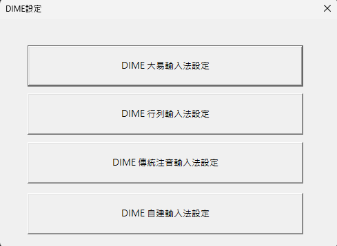
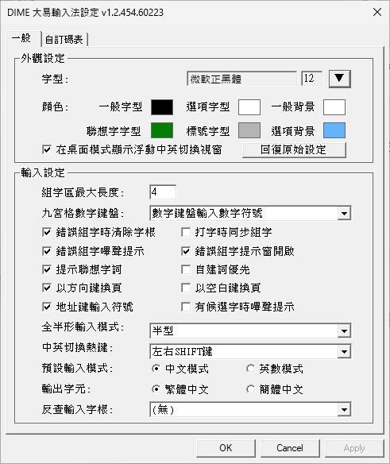
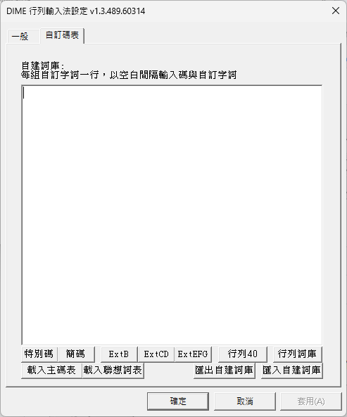
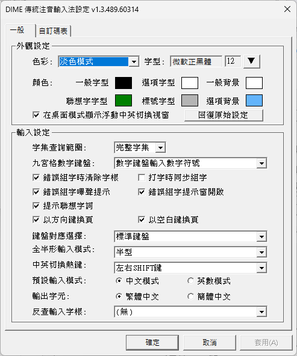
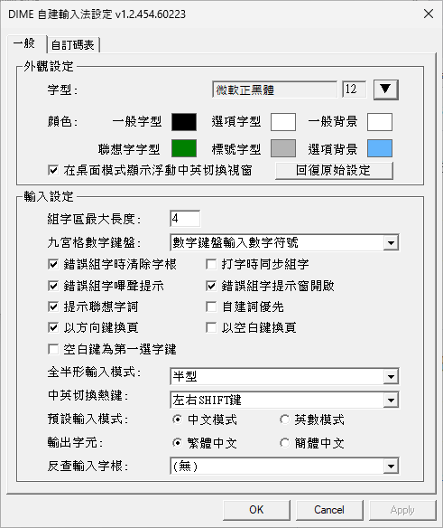
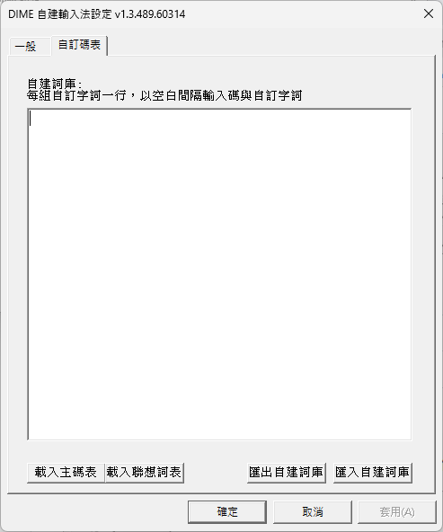

# DIME 輸入法設定（v1.3.588 及更早版本）

> 此文件適用於 v1.3.588 及更早版本的 DIME 設定介面（PropertySheet 對話方塊）。
> 新版設定介面請參考 [README — DIME 輸入法設定](../README.md#dime-輸入法設定)。

---

可透過開始選單中的「DIME設定」開啟設定程式，選擇要設定的輸入法：



也可以在使用輸入法時，按下 `Ctrl + \` 直接開啟該輸入法的設定頁面。

## 通用設定

以下設定在所有輸入法設定頁面中皆可使用：

| 設定 | 說明 |
|------|------|
| 九宮格數字鍵盤 | 設定右方九宮格數字鍵盤的功能（**數字輸入**或**選字**）。設為**數字輸入**可在中文輸入模式下直接按數字鍵盤輸入阿拉伯數字 |
| 錯誤組字時清除字根 | 輸入錯誤時自動清除已輸入的字根 |
| 錯誤組字嗶聲提示 | 輸入錯誤時發出嗶聲 |
| 錯誤組字提示窗開啟 | 輸入錯誤時顯示提示視窗 |
| 提示聯想字詞 | 選字後顯示相關聯想詞 (切換`先查詢自建詞庫再查詢主碼表`/`先查詢主碼表再查詢自建詞庫`) |
| 以方向鍵換頁 | 使用左右方向鍵切換候選字頁面 |
| 以空白鍵換頁 | 使用空白鍵切換至下一頁候選字 |
| 全半形輸入模式 | 設定`全形`/`半形`輸入模式（以 Shift+Space 切換、全形、半形） |
| 中英切換熱鍵 | 設定切換`中文`/`英數`輸入的熱鍵（左右 Shift、右 Shift、左 Shift、僅 Ctrl+Space） |
| 預設輸入模式 | 啟動時預設為`中文`或`英數`模式 |
| 輸出字元 | 輸出繁體中文或簡體中文 (簡繁轉換) |
| 反查輸入字根 | 選擇用於反查字根的輸入法（可與 Windows 內建輸入法互查） |
| 字集查詢範圍 | 過濾簡體中文及罕用字元，僅顯示繁體中文（Big5）字集候選字，減少選字數量（v1.3+） |

> **字集查詢範圍**（v1.3+）：選擇繁體中文字集後，候選字清單將僅顯示 CP950（Big5）範圍內的繁體中文字元，過濾掉簡體中文字及 CJK 擴充 A 區以上的罕用字，讓打字時候選字數量更少、更精準。適合以繁體中文輸出為主、不需要輸入簡體或罕用字的使用情境。所有輸入法均透過各自設定頁面的「字集查詢範圍」選項切換：行列輸入法請選擇 `行列30 Big5 (繁體中文)`；大易、注音、自建輸入法選擇 `繁體中文`。

## 外觀設定

設定輸入法選字窗與通知視窗的字型與顏色，並可選擇是否在桌面模式下跟隨游標顯示浮動中英切換提示視窗。

| 設定 | 說明 |
|------|------|
| 字型 | 候選字視窗的字型與大小 |
| 顏色 | 候選字視窗各元素的顏色設定（一般字型、選項字型、背景、聯想字、標號等） |
| 在桌面模式顯示浮動中英切換視窗 | 跟隨系統游標顯示浮動`中文`/`英數`切換提示視窗 |
| 回復原始設定 | 將外觀設定還原為預設值 |

> **色彩模式**（v1.3+）：`淺色模式`、`深色模式`、`自訂` 為三套各自獨立的色彩組合，每套均可透過「顏色」設定個別自訂六項配色。Windows 10 1089 版後，Windows開始支援深淺色模式，色彩模式會有`跟隨系統`選項。 設定`跟隨系統` 時 DIME 依 Windows 淺色/深色模式設定(設定->個人->色彩)，自動切換至 `淺色模式` 或 `深色模式` 色彩組合。

## DIME 大易

標準大易輸入法，支援 Windows 內建碼表或自行提供 .cin 碼表。



**大易專屬設定：**

| 設定 | 說明 |
|------|------|
| 地址鍵輸入符號 | 啟用後可用地址鍵輸入全形符號（見下表） |
| 有候選字時嗶聲提示 | 出現候選字時發出提示音 |

**地址鍵符號對照表：**

| 按鍵 | 地址模式 | 符號模式 |
|------|----------|----------|
| ` | 巷 | ： |
| ' | 號 | ， |
| [ | 路 | 。 |
| ] | 街 | ？ |
| - | 鄉 | 、 |
| \ | 鎮 | ； |

## DIME 行列

標準行列輸入法（行列30/行列40），內建行列最新碼表，支援 Unicode CJK Ext-A~G（行列30）。


**行列專屬設定：**

| 設定 | 說明 |
|------|------|
| 行列查詢碼表 | 選擇行列30或行列40模式（見下表） |
| 僅接受輸入特別碼 | 啟用後僅能輸入特別碼，不接受一般字碼 |
| 特別碼提示 | 輸入一般字碼時提示對應的特別碼 |
| 以 `'` 鍵查詢自建詞庫 | `'` 為詞彙結束鍵，勾選時查詢自建詞庫，否則查詢內建行列詞庫 |

**字集查詢範圍選項：**

| 選項 | 說明 |
|------|------|
| 行列30 Big 5 (繁體中文) | 僅查詢行列30 Big5 繁體中文 (v1.3+) |
| 行列30 Unicode Ext-A | 查詢行列30 CJK 基本區與擴充 A 區 |
| 行列30 Unicode Ext-AB | 查詢行列30 CJK 基本區與擴充 A、B 區 |
| 行列30 Unicode Ext-A~D | 查詢行列30 CJK 基本區與擴充 A~D 區 |
| 行列30 Unicode Ext-A~J | 查詢行列30 CJK 基本區與擴充 A~J 區 |
| 行列40 Big5 | 行列40 Big5 字集 |

**行列額外碼表：**

行列輸入法頁面`載入主碼表`按鍵可載入客製行列30主碼表，並支援載入額外碼表，透過此頁面的按鈕進行載入：



| 按鈕 | 碼表檔案 | 說明 |
|------|---------|------|
| `特別碼` | Array-special.cin | 載入行列特別碼碼表 |
| `簡碼` | Array-shortcode.cin | 載入行列簡碼碼表 |
| `ExtB` | Array-Ext-B.cin | 載入行列CJK 擴充 B 區罕用字碼表 |
| `ExtCD` | Array-Ext-CD.cin | 載入行列CJK 擴充 C、D 區罕用字碼表 |
| `ExtEFG` | Array-Ext-EF.cin | 載入行列CJK 擴充 E - J 區罕用字碼表 |
| `行列詞庫` | Array-Phrase.cin | 載入行列詞彙輸入碼表|
| `行列40` | Array40.cin | 載入行列40 碼表|

> **自訂碼表提示：** 若要客製化這些碼表內容，可直接編輯內建的 .cin 檔案（位於 `%ProgramFiles%\DIME\` 目錄），編輯存檔後點選對應按鈕重新載入即可生效。碼表格式請參考[自訂碼表格式](../README.md#自訂碼表格式-cin)說明。

## DIME 傳統注音

傳統注音輸入法，支援標準/許氏鍵盤排列。



**注音專屬設定：**

| 設定 | 說明 |
|------|------|
| 鍵盤對應選擇 | 選擇標準注音鍵盤或許氏鍵盤排列 |

## DIME 自建

自建 .cin 碼表輸入法，可載入任意 .cin 碼表作為輸入法使用。



**自建專屬設定：**

| 設定 | 說明 |
|------|------|
| 組字區最大長度 | 設定輸入碼的最大字元數 |
| 打字時同步組字 | 輸入時即時查詢並顯示候選字 |
| 空白鍵為第一選字鍵 | 以空白鍵選擇第一個候選字 |

## 自訂碼表與自建詞庫

所有輸入法皆支援自建詞庫功能，可新增常用字詞、專有名詞或特殊符號。



**使用方式：**
- 每行輸入一組自訂字詞，格式為：`輸入碼[空白]自訂字詞`

**範例：**
```
wto 世界貿易組織
tw 台灣
nasa 美國國家航空暨太空總署
un 聯合國
usa 美國
```
  > **傳統注音自訂詞組說明**
  > 
  > 使用傳統注音輸入法自訂詞組功能時，需使用 `\` 鍵導引導跳過注音音節處理流程並進入自訂詞組模式。請注意，`\` 僅作為引導鍵，不會作為查詢自訂詞組表的編碼查詢。

  > **自建詞庫即時格式檢查 (v1.3+)**
  >
  > 自訂詞庫編輯器內建即時驗證機制，在輸入過程中自動以顏色標記錯誤行，無需等到套用才發現格式問題。
  > 觸發時機：按下 Enter 或空白鍵（分隔符）後、貼上內容後、大量刪除後，以及持續輸入時每隔 N 個按鍵。套用或匯出時亦會執行一次驗證；若有錯誤則中止操作並提示使用者。
  > 驗證採三級層次，依嚴重程度以不同顏色標示：
  >
  >  | 層級 | 顏色 | 錯誤類型 | 說明 |
  >  |------|------|----------|------|
  >  | Level 1 | 洋紅色 | 格式錯誤 | 行不符合「輸入碼 空白 字詞」格式） |
  >  | Level 2 | 橘色 | 輸入碼過長 | 輸入碼長度超過輸入法設定組字區最大長度(行列固定為5，大易、自建可在設定頁面設定，傳統注音為 64) |
  >  | Level 3 | 紅色 | 無效字碼 | 輸入碼中含有非輸入法字根 (傳統注音因有引導鍵，無限制) |
  > **顏色配色會依目前介面主題（深色／淺色）自動調整。**
  >
  > Level 3 字元檢查規則依輸入法模式而異：
  >- **傳統注音**：輸入碼允許可列印 ASCII 字元（`!` 至 `~`），但首碼不得為 `?` 萬用字元
  >- **其他輸入法**：輸入碼必須為輸入法字根

**功能按鈕：**

| 按鈕 | 說明 |
|------|------|
| 載入主碼表 | 載入自訂的 .cin 主碼表檔案 |
| 載入聯想詞表 | 載入額外的聯想詞庫 |
| 載入詞庫 | 載入行列詞庫（行列輸入法專用） |
| 匯出自建詞庫 | 將目前自建詞庫匯出為檔案備份 |
| 匯入自建詞庫 | 從檔案匯入自建詞庫（支援 UTF-8 及各種編碼） |

**相關設定：**
- **自建詞優先**：勾選後，輸入時會優先顯示自建詞庫中的字詞 (傳統注音輸入法無此設定)
- **以 `'` 鍵查詢自建詞庫**（行列輸入法專用）：`'` 為行列詞彙輸入結束鍵，以 `'` 結束組字時，若勾選此選項會查詢自建詞庫，若不勾選則查詢內建行列詞庫（Array-Phrase.cin）
